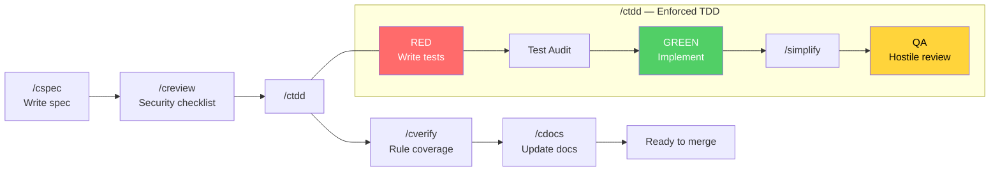
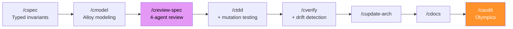
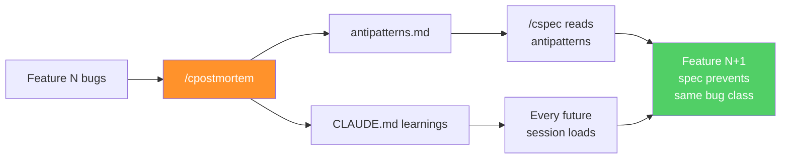
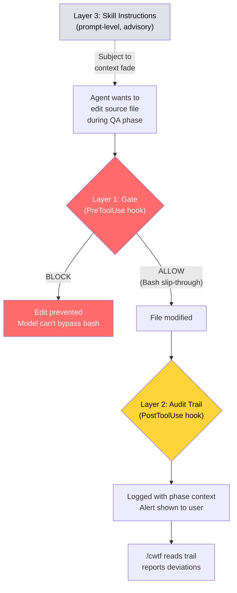
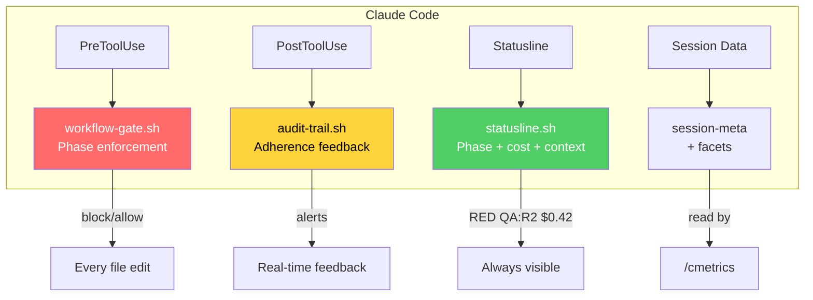

# Correctless

[](https://scorecard.dev/viewer/?uri=github.com/joshft/correctless)
[](https://github.com/joshft/correctless/actions/workflows/ci.yml)
[](https://opensource.org/licenses/MIT)
[](docs/skills/)
[](CHANGELOG.md)

Composable [Claude Code](https://docs.anthropic.com/en/docs/claude-code) skills that enforce a correctness-oriented development workflow. Spec before you code. Test before you implement. Never let an agent grade its own work.

## The Problem

AI coding assistants are fast but sloppy. They write code that works for the happy path, skip edge cases, and silently introduce bugs that don't surface until production. The same model that wrote the code will review it and say "looks good" — because it's confirming its own decisions.

Correctless fixes this by structuring the workflow so that **every phase is executed by a different agent with a different lens**:

- The **spec agent** asks "what does correct mean?" and researches current best practices before any code exists
- The **review agent** reads the spec cold and checks for security gaps, unstated assumptions, and untestable rules
- The **test agent** writes tests from the spec without knowing the implementation plan
- The **test auditor** checks whether those tests would actually catch bugs or just pass against mocks
- The **implementation agent** makes the tests pass without having written them
- The **QA agent** hunts for bugs with neither the test author's nor the implementer's blind spots
- The **verification agent** checks spec-to-code correspondence without insider knowledge

Same model — but the framing determines what the agent finds.

## One Plugin, Three Intensity Levels

Correctless ships as a single plugin with 26 skills. All skills are always visible. Seven skills are gated behind intensity levels — they check your project's `workflow.intensity` setting and warn if invoked below their minimum threshold. You choose the intensity that matches your project's risk profile.

### Standard Intensity (default)

For web apps, APIs, CLI tools, and everyday development. **~10-15 minutes per feature.**



Each box is a separate agent. The test writer doesn't know the implementation plan. The QA agent didn't write the tests.

### High Intensity

Adds adversarial spec review, convergence auditing, and architecture tracking. For features that handle user auth, payments, or sensitive data. **~30-60 minutes per feature.**

### Critical Intensity

Everything at high intensity plus formal Alloy modeling and live red team assessment. For security-critical infrastructure where a bug is a vulnerability. **~1-2 hours per feature — but the code ships tested, reviewed, and assumption-challenged.**



### Intensity Level Table

| Intensity | Overhead | Unlocked Skills | Best For |
|-----------|----------|----------------|----------|
| **standard** (default) | ~10-15 min | 19 core skills | SaaS, APIs, CLI tools, content sites |
| **high** | ~30-60 min | + /caudit, /creview-spec, /cupdate-arch | Auth, payments, sensitive data |
| **critical** | ~1-2 hours | + /cmodel, /credteam | Security infrastructure, network proxies |

Skills like `/cpostmortem` and `/cdevadv` are available at all intensity levels.

**Put another way:** Standard intensity is like having someone next to you going through a checklist to make sure your project has some sanity. Critical intensity is like taking your Claude Max subscription tokens, setting them on fire, collecting the ash, and using it to create a tiny diamond.

## Quick Start

You need [Claude Code](https://docs.anthropic.com/en/docs/claude-code) and a Claude Max subscription ($100-200/mo).

### Via Plugin Marketplace (recommended)

```
/plugin marketplace add joshft/correctless
/plugin install correctless
/csetup
```

### Via Git Clone (alternative)

```bash
git clone https://github.com/joshft/correctless.git .claude/skills/workflow
.claude/skills/workflow/setup
/csetup
```

Standard intensity by default. To increase intensity: add `"intensity": "high"` or `"critical"` to the `workflow` section of `.correctless/config/workflow-config.json` and re-run setup.

### After Install

```
git checkout -b feature/my-feature
/cspec
```

### Updating

```
/plugin uninstall correctless
/plugin marketplace remove correctless
/plugin marketplace add joshft/correctless
/plugin install correctless
```
Then restart Claude Code.

**Git clone:** `cd .claude/skills/workflow && git pull && ./setup`

### Migration from Previous Versions

If you have `correctless-lite` installed:
```
/plugin uninstall correctless-lite
/plugin marketplace remove correctless
/plugin marketplace add joshft/correctless
/plugin install correctless
```

If you have correctless (Full) installed:
```
/plugin uninstall correctless
/plugin marketplace remove correctless
/plugin marketplace add joshft/correctless
/plugin install correctless
```

For git-clone users, `git pull && ./setup` handles the migration automatically — it detects old distribution directories and cleans them up.

Your existing specs, antipatterns, architecture docs, and workflow config carry over. If you had `workflow.intensity` set, it is preserved at your configured level.

## How It Works

### 1. Project Health Check

On first run, [`/csetup`](docs/skills/csetup.md) scans your project for baseline hygiene: hardcoded secrets, missing CI, no linter, no tests, committed build artifacts. Produces a health card with 19 checks across security, code quality, testing, CI/CD, documentation, and git hygiene. For existing projects, it mines your codebase for conventions and architecture patterns before asking you to describe them.

### 2. Spec Before Code

Every feature starts with a spec ([`/cspec`](docs/skills/cspec.md)) that defines what "correct" means — testable rules, not vague goals. Automatic intensity detection evaluates file paths, keywords, trust boundaries, and antipattern history to recommend the right rigor level for each feature. The spec agent reads your architecture docs, known bug patterns, and QA findings history. When the feature involves libraries or protocols that may have changed, a **research subagent** searches the web for current docs, CVEs, and deprecations before rules are written.

### 3. Skeptical Review with Security Checklist

A fresh agent ([`/creview`](docs/skills/creview.md)) that didn't write the spec reads it cold. This includes an **automatic security checklist** that fires based on what the spec touches — auth, user input, data storage, payments, APIs, multi-tenant. It checks for the vulnerabilities that vibe-coded apps ship with: missing CSRF, SSRF, broken access control, SQL injection, XSS, missing database RLS. At high+ intensity, [`/creview-spec`](docs/skills/creview-spec.md) runs a four-agent adversarial team instead.

### 4. Enforced TDD with Test Audit

[`/ctdd`](docs/skills/ctdd.md) enforces agent separation: the test agent writes tests from the spec, a test auditor checks test quality, a separate implementation agent makes them pass, and a QA agent reviews both. Hooks block source code edits until tests exist. Every QA finding requires both an instance fix AND a class fix.

### 5. Verification and Documentation

[`/cverify`](docs/skills/cverify.md) checks that the implementation actually satisfies the spec — not just the test cases. [`/cdocs`](docs/skills/cdocs.md) updates documentation from the verification report. The state machine enforces both steps before merge.

### 6. The Compounding Effect



Escaped bugs become antipatterns. Antipatterns become spec rules. Spec rules become tests. Six months in, the workflow knows your project's failure modes better than any individual developer.

### 7. Defense in Depth — Why Enforcement is Bash, Not Prompts

Prompt-level instructions fade as context fills — enforcement that depends on the model is a suggestion. Correctless uses three independent layers:



**Fresh agents per phase** add resilience: each phase spawns a new agent at 0% context with fresh instructions via `context: fork`. A QA agent at 0% follows hostile-lens instructions perfectly. A single agent at 70% may have forgotten it was supposed to be hostile.

## Skills

### Core Workflow

| Skill | When to Use | Description |
|-------|------------|-------------|
| [`/csetup`](docs/skills/csetup.md) | First run, or re-run for health check | Project detection, convention mining, 19-point health check |
| [`/cspec`](docs/skills/cspec.md) | Starting a new feature | Write testable rules with research agent |
| [`/creview`](docs/skills/creview.md) | After /cspec | Skeptical review + OWASP security checklist (~3 min) |
| [`/ctdd`](docs/skills/ctdd.md) | After review approves spec | RED -> test audit -> GREEN -> /simplify -> QA |
| [`/cverify`](docs/skills/cverify.md) | After /ctdd completes | Verify implementation matches spec |
| [`/cdocs`](docs/skills/cdocs.md) | After /cverify | Update README, AGENT_CONTEXT, feature docs |
| [`/crelease`](docs/skills/crelease.md) | After merging features, ready to tag | Version bump, changelog, sanity checks, annotated tag |

### Code Quality

| Skill | When to Use | Description |
|-------|------------|-------------|
| [`/cquick`](docs/skills/cquick.md) | Small, well-understood changes | TDD without the ceremony — scope-guarded at 50 LOC / 3 files |
| [`/crefactor`](docs/skills/crefactor.md) | Restructuring without changing behavior | Characterization tests, behavioral equivalence, agent separation |
| [`/cdebug`](docs/skills/cdebug.md) | Stuck on a bug | Root cause -> hypothesis -> bisect -> TDD fix -> class fix |
| [`/cpr-review`](docs/skills/cpr-review.md) | Someone opens a PR against your project | Architecture, security, tests, antipatterns, dep bumps |

### Open Source

| Skill | When to Use | Description |
|-------|------------|-------------|
| [`/ccontribute`](docs/skills/ccontribute.md) | Contributing to someone else's project | Learn conventions, match patterns, pre-flight, generate PR |
| [`/cmaintain`](docs/skills/cmaintain.md) | Reviewing an incoming contribution | Scope, conventions, maintenance burden, pre-written comments |

### Observability

| Skill | When to Use | Description |
|-------|------------|-------------|
| [`/cstatus`](docs/skills/cstatus.md) | Anytime | Current phase, next steps, problem detection |
| [`/chelp`](docs/skills/chelp.md) | First time or need a quick reference | Workflow pipeline, all commands |
| [`/csummary`](docs/skills/csummary.md) | After a feature or mid-feature | What the workflow caught, by phase |
| [`/cmetrics`](docs/skills/cmetrics.md) | Monthly or for ROI analysis | Token cost, bugs caught, session analytics, trends |
| [`/cwtf`](docs/skills/cwtf.md) | When you suspect agents shortcut | Did agents actually follow instructions? |
| [`/cexplain`](docs/skills/cexplain.md) | Onboarding or exploring a codebase | Guided mermaid diagrams, prose walkthroughs, HTML export |

### Intensity-Gated Skills

| Skill | Minimum Intensity | Description |
|-------|-------------------|-------------|
| [`/caudit`](docs/skills/caudit.md) | high+ | Olympics QA/Hacker/Performance convergence audit |
| [`/creview-spec`](docs/skills/creview-spec.md) | high+ | 4-agent adversarial spec review |
| [`/cupdate-arch`](docs/skills/cupdate-arch.md) | high+ | Keep ARCHITECTURE.md current |
| [`/cpostmortem`](docs/skills/cpostmortem.md) | standard | Trace which phase missed an escaped bug, strengthen workflow |
| [`/cdevadv`](docs/skills/cdevadv.md) | standard | Challenge architecture and strategy |
| [`/cmodel`](docs/skills/cmodel.md) | critical+ | Alloy formal modeling |
| [`/credteam`](docs/skills/credteam.md) | critical+ | Live adversarial penetration testing |

## Platform Integration

Correctless hooks into Claude Code's infrastructure for real-time feedback and long-term learning. All features below are **automatic** after `/csetup` unless marked opt-in.



### Statusline (automatic)

The Correctless statusline shows your workflow state at a glance — no commands needed:
```
project/  feature/auth  Opus  34%  RED  QA:R0  $0.42  +87/-12
```
Workflow phase (color-coded), QA round count, session cost, lines delta, context usage with red warning at 70%. Installed during `/csetup`.

### Real-Time Adherence Feedback (automatic)

A PostToolUse hook monitors every file modification and alerts you immediately:
- `tdd-qa: Source file modified — middleware.ts (this phase should be read-only)`
- `GREEN: Test file edited — auth.test.ts (should be logged in test-edit-log)`
- `QA: Read middleware.ts (3 of 7 modified files reviewed)` (at high+ intensity)

### Session Analytics

[`/cmetrics`](docs/skills/cmetrics.md) reads Claude Code's session-meta and facets data for exact token costs, outcome rates, friction analysis, and a **Correctless vs Freeform** comparison table — measured evidence that the workflow helps.

### Compounding Learning

After postmortems, feature completions, and audits, learnings are appended to CLAUDE.md and loaded into every future session automatically. The spec agent just *knows* that "auth features in this project need middleware ordering checks" without being told.

### Git Integration (opt-in)

- **Git trailers** in commit messages: `Spec:`, `Rules-covered:`, `Verified-by:` — queryable via `git log --format='%(trailers:key=Spec)'`
- **Git notes** attaching verification summaries to commits
- **Git bisect** in [`/cdebug`](docs/skills/cdebug.md) for automated regression finding

### MCP Server Integration (opt-in)

`/csetup` offers to configure two MCP servers that improve code analysis across all skills:

- **Serena** — symbol-level code queries (call graphs, references, symbol lookup) instead of reading entire files. 15 skills use it for precise analysis with 40-60% token savings on larger projects.
- **Context7** — current library documentation on demand. The `/cspec` research agent gets real docs for real versions instead of relying on training data.

Both are free, open source, run locally, and fall back silently to grep/read when unavailable. Zero maintenance after setup.

### Output Redaction

External-facing skills ([`/cpr-review`](docs/skills/cpr-review.md), [`/ccontribute`](docs/skills/ccontribute.md), [`/cmaintain`](docs/skills/cmaintain.md)) automatically redact paths, credentials, hostnames, and session IDs before posting to GitHub/GitLab.

## State Management

Check your workflow status with [`/cstatus`](docs/skills/cstatus.md) or the statusline. For advanced debugging:

```bash
.correctless/hooks/workflow-advance.sh diagnose "file" # Why a file is blocked
.correctless/hooks/workflow-advance.sh override "why"  # Temporary gate bypass (10 tool calls)
.correctless/hooks/workflow-advance.sh spec-update "why"  # Spec was wrong mid-TDD
.correctless/hooks/workflow-advance.sh reset           # Nuclear — remove all state
```

### Quick Fixes During an Active Workflow

If you need to fix a typo while a workflow is active and the gate is blocking you:

```bash
.correctless/hooks/workflow-advance.sh override "quick bugfix: fixing typo in error message"
```

This bypasses the gate for 10 tool calls. Use for: typos, config tweaks, one-line fixes. When no workflow is active, the gate allows all edits freely.

## Language Support

| Language | Test Runner | Mutation Tool | PBT Library |
|----------|-------------|---------------|-------------|
| Go | `go test` | go-mutesting | rapid |
| TypeScript | jest/vitest | Stryker | fast-check |
| Python | pytest | mutmut | hypothesis |
| Rust | cargo test | cargo-mutants | proptest |

Mutation testing and PBT helpers are available at high+ intensity. Standard intensity works with any language that has a test runner.

## Requirements

- [Claude Code](https://docs.anthropic.com/en/docs/claude-code) CLI
- A **Claude Max subscription** ($100/mo or $200/mo plan). Correctless spawns multiple agents per feature — the $200/mo Max plan is recommended, especially at high+ intensity.
- A project with a test runner

Optional (at high+/critical intensity):
- [Alloy Analyzer](https://alloytools.org/) for formal modeling
- Mutation testing tool for your language
- Isolated environment (Docker/VPS) for red team assessments

## Glossary

| Term | Meaning |
|------|---------|
| **Agent separation** | Each workflow phase runs in a fresh Claude session. The test writer doesn't know the implementation plan; the QA agent didn't write the tests. Prevents confirmation bias. |
| **Instance fix** | Fix the one bug here and now. |
| **Class fix** | Fix the entire category of this bug — add a structural test that prevents recurrence. |
| **Convergence** | Run multiple audit rounds until findings stabilize (no new critical/high issues). |
| **Drift** | Code that no longer matches documented architecture. Detected by `/cverify`, tracked in drift-debt.json. |
| **Antipattern** | A known bug class from your project's history. Stored in `.correctless/antipatterns.md`, checked by every future spec and review. |
| **Spec** | A document defining what "correct" means for a feature: testable rules, edge cases, security assumptions. A spec that can't be tested is incomplete. |
| **Invariant** | A rule that must always be true: "auth tokens expire after 24 hours." Specs are lists of invariants. |
| **Intensity** | The configured rigor level for a project: standard, high, or critical. Higher intensity unlocks more skills but costs more tokens and time. |
| **Mutation testing** | Introduce small bugs into code and check if tests catch them. If a test passes with a mutation, that test is weak. Available at high+ intensity. |
| **STRIDE** | Threat modeling framework: Spoofing, Tampering, Repudiation, Information Disclosure, Denial of Service, Elevation of Privilege. |
| **RED / GREEN** | TDD phases. RED = write tests that fail. GREEN = write code to make tests pass. |

## Status

**Correctless 3.0.0 — Early release.** 26 skills with configurable intensity levels, 1,518 automated tests, 4 hooks (gate, state machine, statusline, audit trail). Real-world usage ongoing — file issues as you find them.

## License

MIT
