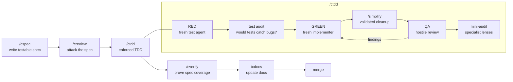
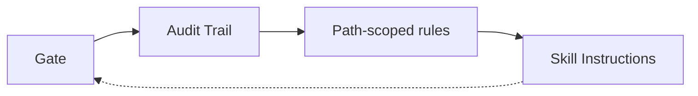

<p align="center">
  
</p>

[](https://scorecard.dev/viewer/?uri=github.com/joshft/correctless)
[](https://github.com/joshft/correctless/actions/workflows/ci.yml)
[](https://opensource.org/licenses/MIT)
[](docs/skills/)
[](CHANGELOG.md)

# Correctless

AI coding agents are velocity machines. Correctless is the correctness system around them.

It does not try to make one agent smarter, faster, and more confident. It makes wrong answers harder to merge. A spec agent defines what correct means, a reviewer attacks the spec, a test agent writes failing tests without seeing the implementation plan, an auditor checks whether those tests would catch real bugs, a separate implementer makes them pass, QA hunts for defects, and verification checks the final code against the original rules.

Most AI workflows optimize for throughput. Correctless optimizes for trust.

## Why This Exists

Fast AI development has a recurring failure mode: the same model plans the work, writes the code, writes the tests, reviews the result, and then reports that everything looks good. That is not review. That is self-confirmation with extra steps.

Correctless breaks that loop.

| Velocity-first workflow | Correctless workflow |
|-------------------------|----------------------|
| "Build the feature and test it." | "Define correctness before code exists." |
| One long-lived agent accumulates assumptions. | Fresh agents run each phase with different instructions. |
| Tests often mirror the implementation. | RED tests are written before the implementation plan. |
| Reviews happen after code exists. | Specs are attacked before code can bias the reviewer. |
| Prompt discipline fades as context fills. | Bash hooks enforce phase gates and log violations. |
| Escaped bugs become tribal memory. | Escaped bugs become antipatterns, spec rules, tests, and future review checks. |

The point is not ceremony. The point is to create independent pressure from multiple angles before bad code reaches main.

## What Correctless Gives You

**A spec-to-merge correctness pipeline.** `/cspec -> /creview -> /ctdd -> /cverify -> /cdocs` turns vague requests into testable rules, adversarial review, enforced TDD, verification, and documentation.

**Agent separation by design.** The spec author, reviewer, test writer, implementer, QA agent, mini-audit agents, and verifier are different agents with different lenses. The test writer does not know the implementation plan. The QA agent did not write the code. The verifier checks against the spec, not against the implementer's story.

**Mechanical enforcement where prompts are weak.** `workflow-gate.sh` blocks source edits during RED and all writes during QA. `audit-trail.sh` records what actually happened. `sensitive-file-guard.sh` catches naive Edit/Write tool calls to protected paths. `workflow-advance.sh` owns phase transitions.

**Adversarial depth when risk is high.** High intensity adds 6-agent spec review, convergence audits, architecture adherence checks, review-driven mini-audit lenses, mutation/config probes, and architecture maintenance. Critical intensity adds Alloy modeling and live red-team assessment.

**A memory loop that compounds.** Postmortems, QA findings, audit findings, deferred review items, and antipatterns feed back into future specs and reviews. Correctless gets more project-specific over time.

**Autonomy with brakes.** `/cauto` can run from approved spec to PR. `/cchores` can pick one suitable issue, fix it via `/cdebug`, run a regression oracle, redact outbound text, and open one PR. Both are bounded by explicit gates, manifests, decision logs, and fail-closed behavior.

**Visibility into the workflow itself.** `/cstatus`, `/csummary`, `/cmetrics`, `/cdashboard`, and `/cwtf` show current phase, cost, findings, shortcuts, stale artifacts, and whether agents actually followed the process.

## Quick Start

You need [Claude Code](https://docs.anthropic.com/en/docs/claude-code), a Claude Max subscription, `jq`, Bash 4+, and a project with a test runner.

### Install

```text
/plugin marketplace add joshft/correctless
/plugin install correctless
/csetup
```

<details>
<summary>Alternative: Git clone</summary>

```bash
git clone https://github.com/joshft/correctless.git .claude/skills/workflow
.claude/skills/workflow/setup
/csetup
```
</details>

### Start a Feature

```bash
git checkout -b feature/my-feature
```

```text
/cspec
```

Standard intensity is the default. To raise the floor, set `"intensity": "high"` or `"critical"` under `workflow` in `.correctless/config/workflow-config.json`.

### Update

```text
/plugin uninstall correctless
/plugin marketplace remove correctless
/plugin marketplace add joshft/correctless
/plugin install correctless
```

Then restart Claude Code and run `/csetup`. Git clone users can update with:

```bash
cd .claude/skills/workflow
git pull
./setup
```

## The Core Pipeline



Passing tests are not the finish line. Correctless asks:

- Did every spec rule get a meaningful test?
- Would the test fail if the implementation were subtly wrong?
- Did QA read the changed files and hunt for edge cases?
- Did the implementation introduce dependencies or architecture drift not justified by the spec?
- Did any agent edit files in a phase where it should have been read-only?
- Did documentation and architecture stay current enough for the next feature?

## Intensity Levels

Correctless ships as one plugin with 33 skills. Intensity controls how much rigor activates for a feature.

| Intensity | Typical Cost | What Activates | Best For |
|-----------|--------------|----------------|----------|
| `standard` | ~10-15 min | Core spec, review, TDD, verify, docs, debug, refactor, release | CRUD, CLI tools, internal apps |
| `high` | ~30-60 min | 6-agent spec review, convergence audit, architecture maintenance, mutation/config probes | Auth, payments, sensitive data, cross-component changes |
| `critical` | ~1-2 hr | Alloy modeling and live red-team assessment | Security infrastructure, protocols, crypto, high-blast-radius systems |

`/cspec` recommends intensity from feature signals: touched paths, STRIDE language, compliance requirements, invariant density, historical antipatterns, and prior phase effectiveness. The recommendation is advisory; the human decides.

## Capability Map

### Core Workflow

| Skill | Use It For |
|-------|------------|
| [`/csetup`](docs/skills/csetup.md) | Project health check, convention mining, setup, hook registration |
| [`/cspec`](docs/skills/cspec.md) | Testable specs, research, intensity recommendation, integration contracts |
| [`/creview`](docs/skills/creview.md) | Skeptical spec review with security, assumptions, testability, and historical-pattern checks |
| [`/ctdd`](docs/skills/ctdd.md) | RED, test audit, GREEN, `/simplify`, QA, probes, mini-audit |
| [`/cverify`](docs/skills/cverify.md) | Rule coverage, mutation signal, dependency review, architecture adherence, drift detection |
| [`/cdocs`](docs/skills/cdocs.md) | README, AGENT_CONTEXT, ARCHITECTURE, feature docs, cost artifacts |
| [`/carchitect`](docs/skills/carchitect.md) | Reverse-engineer or design structured architecture with machine-readable entrypoints |
| [`/cauto`](docs/skills/cauto.md) | Run the implementation pipeline through PR creation with resume and decision logging |
| [`/crelease`](docs/skills/crelease.md) | Version bump, changelog, release sanity checks, annotated tag |

### Code Quality

| Skill | Use It For |
|-------|------------|
| [`/cquick`](docs/skills/cquick.md) | Small TDD fixes without full spec ceremony |
| [`/cdebug`](docs/skills/cdebug.md) | Reproduce, diagnose, bisect, and fix bugs with a TDD loop |
| [`/crefactor`](docs/skills/crefactor.md) | Behavior-preserving refactors with characterization tests |
| [`/cpr-review`](docs/skills/cpr-review.md) | Multi-lens PR review, including dependency-bump review |
| [`/cexplain`](docs/skills/cexplain.md) | Guided codebase exploration with diagrams and confidence markers |

### High-Rigor Analysis

| Skill | Use It For |
|-------|------------|
| [`/creview-spec`](docs/skills/creview-spec.md) | 6-agent adversarial spec review: red team, assumptions, testability, design contract, upgrade compatibility, UX |
| [`/caudit`](docs/skills/caudit.md) | Olympics-style convergence audits for QA, hacker, performance, UX, or custom lenses |
| [`/cupdate-arch`](docs/skills/cupdate-arch.md) | Keep trust boundaries, abstractions, patterns, and assumptions current |
| [`/cmodel`](docs/skills/cmodel.md) | Alloy formal modeling for state machines, protocols, and invariants |
| [`/credteam`](docs/skills/credteam.md) | Live adversarial red-team assessment in an isolated environment |
| [`/cpostmortem`](docs/skills/cpostmortem.md) | Convert escaped bugs into class fixes and future review pressure |
| [`/cdevadv`](docs/skills/cdevadv.md) | Challenge architecture and strategy with a devil's-advocate lens |
| [`/cmodelupgrade`](docs/skills/cmodelupgrade.md) | Compare model/harness behavior against historical pipeline baselines |

### Observability and Maintenance

| Skill | Use It For |
|-------|------------|
| [`/cstatus`](docs/skills/cstatus.md) | Current phase, next steps, stale state, harness advisories |
| [`/chelp`](docs/skills/chelp.md) | Compact command reference |
| [`/csummary`](docs/skills/csummary.md) | What the workflow caught on a feature |
| [`/cmetrics`](docs/skills/cmetrics.md) | Token cost, phase metrics, override health, audit staleness, ROI |
| [`/cdashboard`](docs/skills/cdashboard.md) | HTML dashboard with metrics and artifact browser |
| [`/cwtf`](docs/skills/cwtf.md) | Workflow accountability: did agents follow instructions or shortcut? |
| [`/ctriage`](docs/skills/ctriage.md) | Wizard-style triage of deferred review findings |
| [`/cprune`](docs/skills/cprune.md) | Archive stale docs, clean orphaned artifacts, fix count drift |
| [`/cchores`](docs/skills/cchores.md) | Autonomous one-issue backlog grooming with fail-closed PR creation |

### Open Source

| Skill | Use It For |
|-------|------------|
| [`/ccontribute`](docs/skills/ccontribute.md) | Learn another project's conventions and produce maintainer-friendly PRs |
| [`/cmaintain`](docs/skills/cmaintain.md) | Review external contributions through a maintainer lens |

## What Happens Under the Hood

### Fresh Lenses

Correctless uses 16 plugin agents with narrow roles and pinned tool access, including RED/GREEN TDD agents, a research agent, architecture reviewers, 6 spec-review agents, a fix-diff reviewer, a supervisor, a decision agent, and a `/cchores` issue classifier. The tool allowlists are not just safety limits; they shape the agent into the job it is supposed to do.

### Hooks

Correctless installs 9 hooks/config hooks after `/csetup`:

| Hook | Role |
|------|------|
| `workflow-gate.sh` | Phase-gated file writes: RED blocks source edits, QA blocks writes, verified phases block implementation changes |
| `sensitive-file-guard.sh` | Edit/Write tool-path guard for secrets, protected config, and sanctioned-writer files. It does not inspect Bash commands |
| `audit-trail.sh` | PostToolUse event log with phase and file context |
| `auto-format.sh` | Best-effort formatting after edits |
| `token-tracking.sh` | Subagent token, duration, cost, phase, and skill logging |
| `statusline.sh` | Live phase, cost, context, QA round, and line delta display |
| `workflow-advance.sh` | State machine, transition checks, spec integrity, audit persistence gates |
| `instructions-loaded.sh` | Rule-load telemetry for `/cwtf` accountability |
| `import-guard.json` | Agent hook that discourages integration-test bypasses |

The sensitive-file guard is intentionally honest about its boundary: it catches naive `Edit`/`Write`/`MultiEdit`/`NotebookEdit`/`CreateFile` writes to protected paths. Bash-mediated writes are accepted non-goals. Correctless treats hooks as cooperative-loop guardrails, then backs important contracts with diff gates, phase gates, tests, and reviewer pressure where needed.

### Defense in Depth

Correctless does not bet the project on a single prompt, hook, or reviewer pass. It uses four independent layers that cross-check the work before code is treated as done:



### Project Memory

Correctless keeps local artifacts that future skills consume:

- `.correctless/specs/` for feature specs
- `.correctless/artifacts/` for review findings, QA findings, audit rounds, summaries, costs, trails, and pipeline manifests
- `.correctless/meta/` for calibration, deferred findings, drift debt, model baselines, and cross-feature intelligence
- `.correctless/antipatterns.md` for known bug classes
- `.correctless/ARCHITECTURE.md` for trust boundaries, abstractions, patterns, and environment assumptions

The result is a feedback loop: a bug caught in QA becomes a finding, a repeated finding becomes an antipattern, an antipattern becomes a spec/review check, and the next feature starts with that knowledge loaded.

### Architecture-Aware Development

`/carchitect` and `/cupdate-arch` make architecture machine-referenceable. Entrypoints feed `/cspec` integration contracts and `/ctdd` test-writing constraints. `/cverify` and `/caudit` then check changed code against documented trust boundaries, abstractions, and patterns. Architecture is not a static diagram; it becomes input to the workflow.

### Test Strength, Not Just Test Count

Correctless includes several defenses against impressive-looking but weak tests:

- Test audit before implementation asks whether tests would catch real bugs.
- RED-phase real-fixture rules prevent tests from parsing imaginary producer formats.
- Integration contracts push tests through documented entrypoints.
- Mutation and config probes at high+ intensity try to keep tests from passing after adversarial changes.
- `/cverify` maps every rule to tests and implementation evidence.

## Autonomous Modes

Correctless can run hands-off, but autonomy is bounded.

`/cauto` orchestrates the main pipeline from approved spec to PR. It writes a pipeline manifest, checks install freshness, resumes interrupted phases, records decisions, validates `/simplify` output, stages only expected paths, and escalates on architectural decisions, persistent failures, security concerns, or budget exhaustion.

`/cchores` handles one suitable issue at a time. It classifies candidates, fences untrusted issue text, branches from a fresh default branch, delegates the fix to `/cdebug`, runs a regression oracle, redacts outbound text, runs a CI-superset pre-PR gate, and opens exactly one PR. Ambiguity means abort, not guess.

## Platform Integration

### Statusline

```text
project/  feature/auth  Opus  34%  RED  QA:R0  $0.42  +87/-12
```

The statusline surfaces phase, QA round, session and feature cost, context usage, and line delta. Cost data comes from Claude Code session transcripts and is cached for lightweight display.

### Dashboard and Metrics

`/cmetrics` and `/cdashboard` report token cost, phase counts, QA rounds, audit staleness, override health, deferred findings, and artifact history. This is useful for answering the practical question: "What did the workflow catch, and what did it cost?"

### Optional MCP

`/csetup` can configure:

- **Serena** for symbol-level code queries and call graph analysis.
- **Context7** for current library documentation during spec research.

Both degrade gracefully when unavailable.

## Language Support

Standard intensity works with any project that has a test command. High+ intensity has helper guidance and mutation support for common stacks:

| Language | Test Runner | Mutation Tool | PBT Library |
|----------|-------------|---------------|-------------|
| Go | `go test` | `go-mutesting` | `rapid` |
| TypeScript | Jest/Vitest | Stryker | `fast-check` |
| Python | pytest | mutmut | Hypothesis |
| Rust | `cargo test` | cargo-mutants | proptest |

## Requirements

- [Claude Code](https://docs.anthropic.com/en/docs/claude-code)
- Claude Max subscription. High+ intensity intentionally spends tokens on independent review pressure
- `jq` 1.7+
- Bash 4+
- Git
- A project test command

Optional:

- Alloy Analyzer for `/cmodel`
- Mutation tool for your language
- Docker, VM, or equivalent isolated environment for `/credteam`
- `gh` for PR creation and `/cchores`

## Good To Know

**Correctless is opt-in per branch.** It is passive when no workflow is active. Start with `/cspec` on a feature branch.

**It does not require CI changes.** Correctless runs inside Claude Code via local hooks, scripts, skills, and artifacts.

**It is built for uncomfortable evidence.** A good run may produce blocking findings. That is the point. The workflow is doing its job when it finds the bug before your users do.

**It is not a security perimeter.** Correctless improves the cooperative agent loop. It does not sandbox the operating system, prevent all Bash writes, or replace code review for high-risk systems.

## Project Scale

Current source tree:

- 33 skills
- 16 plugin agents
- 9 hooks/config hooks
- 40 shared scripts plus workflow modules
- 111 tracked test scripts
- 22 feature docs
- 3 intensity levels

## Uninstall

Order matters. Remove hook references before deleting `.correctless/`, or Claude Code may still point at missing fail-closed hook scripts.

```text
/plugin uninstall correctless
```

Then clean `.claude/settings.json` of hook entries that reference `.correctless/hooks/` or `hooks/`.

After that, remove Correctless sections from `CLAUDE.md`, remove Correctless MCP entries from `.mcp.json`, remove `.serena.yml` if created by setup, remove Correctless `.gitignore` entries, and delete:

```bash
rm -rf .correctless/
```

## Glossary

| Term | Meaning |
|------|---------|
| Agent separation | Each phase uses a different agent/lens so no agent grades its own work |
| Class fix | A fix for the whole bug category, not just the observed instance |
| Convergence | Repeated audit rounds until no new critical/high findings appear |
| Drift | Code or docs that no longer match the spec or architecture |
| Invariant | A property that must always hold |
| Mini-audit | Specialist review at the end of `/ctdd` after QA |
| Mutation testing | Introduce small bugs and check whether tests fail |
| Spec | A testable definition of correctness for a feature |
| STRIDE | Spoofing, Tampering, Repudiation, Information Disclosure, Denial of Service, Elevation of Privilege |

## Status

Correctless 3.1.1 is an early release with real-world dogfooding. It is opinionated, token-hungry at high intensity, and deliberately slower than freeform agent coding. That is the trade: less raw velocity, more evidence.

File issues at <https://github.com/joshft/correctless/issues>.

## License

MIT
