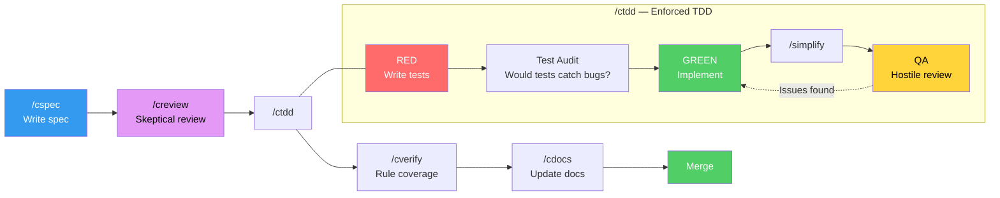
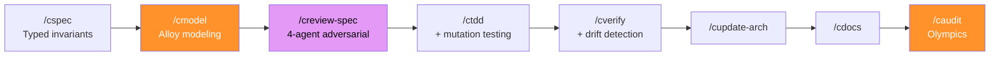
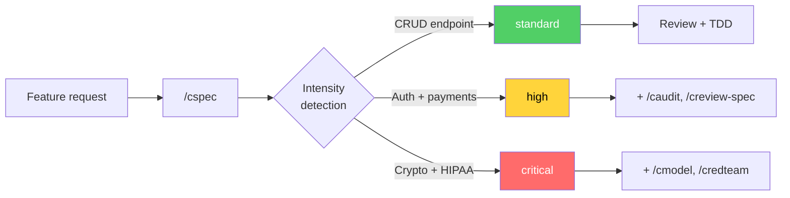
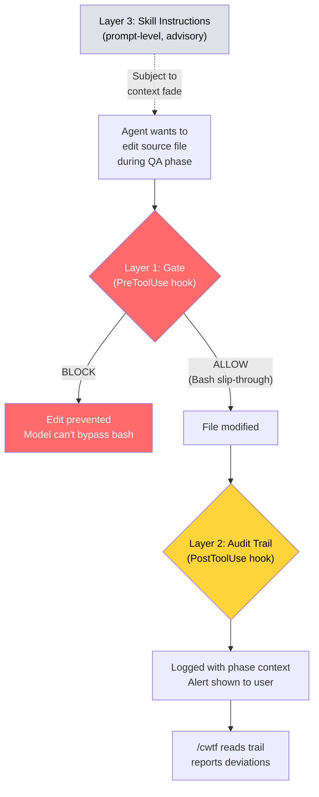
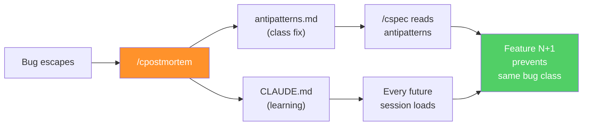
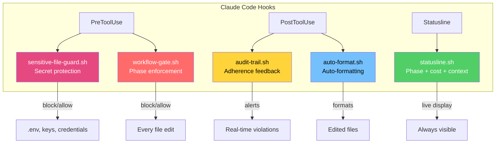

<p align="center">
  
</p>

[](https://scorecard.dev/viewer/?uri=github.com/joshft/correctless)
[](https://github.com/joshft/correctless/actions/workflows/ci.yml)
[](https://opensource.org/licenses/MIT)
[](docs/skills/)
[](CHANGELOG.md)

Composable [Claude Code](https://docs.anthropic.com/en/docs/claude-code) skills that enforce a correctness-oriented development workflow. Spec before you code. Test before you implement. Never let an agent grade its own work.

## The Problem

AI coding assistants are fast but sloppy. They write code that works for the happy path, skip edge cases, and silently introduce bugs that don't surface until production. The same model that wrote the code will review it and say "looks good" — because it's confirming its own decisions.

Correctless fixes this by structuring the workflow so that **every phase is executed by a different agent with a different lens**:

- The **spec agent** asks "what does correct mean?" and researches current best practices before any code exists
- The **review agent** reads the spec cold and checks for security gaps, unstated assumptions, and untestable rules
- The **test agent** writes tests from the spec without knowing the implementation plan
- The **test auditor** checks whether those tests would actually catch bugs or just pass against mocks
- The **implementation agent** makes the tests pass without having written them
- The **QA agent** hunts for bugs with neither the test author's nor the implementer's blind spots
- The **verification agent** checks spec-to-code correspondence without insider knowledge

Same model — but the framing determines what the agent finds.

## Quick Start

You need [Claude Code](https://docs.anthropic.com/en/docs/claude-code) and a Claude Max subscription ($100-200/mo).

### Install

```
/plugin marketplace add joshft/correctless
/plugin install correctless
/csetup
```

<details>
<summary>Alternative: Git clone</summary>

```bash
git clone https://github.com/joshft/correctless.git .claude/skills/workflow
.claude/skills/workflow/setup
/csetup
```
</details>

Standard intensity by default. To increase: add `"intensity": "high"` or `"critical"` to the `workflow` section of `.correctless/config/workflow-config.json`.

### First Feature

```
git checkout -b feature/my-feature
/cspec
```

### Update

```
/plugin uninstall correctless
/plugin marketplace remove correctless
/plugin marketplace add joshft/correctless
/plugin install correctless
```

Then restart Claude Code. Git clone users: `cd .claude/skills/workflow && git pull && ./setup`

## One Plugin, Three Intensity Levels

Correctless ships as a single plugin with 26 skills. You choose the intensity that matches your project's risk profile. Seven skills are gated behind intensity thresholds — they check your project's `workflow.intensity` setting and warn if invoked below their minimum.

| Intensity | Overhead | What You Get | Best For |
|-----------|----------|--------------|----------|
| **standard** | ~10-15 min | 19 core skills: spec, review, TDD, verify, docs, debug, refactor, release | SaaS, APIs, CLI tools, content sites |
| **high** | ~30-60 min | + adversarial spec review, convergence auditing, architecture tracking | Auth, payments, sensitive data |
| **critical** | ~1-2 hours | + Alloy formal modeling, live red team assessment | Security infrastructure, crypto, proxies |

Skills like `/cpostmortem` and `/cdevadv` are available at all intensity levels — they're about learning from the past, not adding rigor to the present.

**Put another way:** Standard intensity is like having someone next to you going through a checklist to make sure your project has some sanity. Critical intensity is like taking your Claude Max subscription tokens, setting them on fire, collecting the ash, and using it to create a tiny diamond.

## How It Works

### The Standard Workflow



Each box is a separate agent. The test writer doesn't know the implementation plan. The QA agent didn't write the tests. A PreToolUse hook blocks source code edits until tests exist — this isn't a suggestion, it's enforced by bash.

> **[View the interactive Standard Workflow guide](standard-workflow.html)** — state machine, hook architecture, phase gating decision tree, and data flow diagrams with rendered mermaid and prose walkthroughs.

### The Critical Workflow



### Intensity Detection

You don't have to pick intensity manually for every feature. `/cspec` evaluates signals in your spec — file paths touching auth/payments, STRIDE threat keywords, compliance references, antipattern history — and recommends the right intensity. You confirm or override.



### Defense in Depth

Prompt-level instructions fade as context fills — enforcement that depends on the model is a suggestion. Correctless uses three independent layers:



**Fresh agents per phase** add resilience: each phase spawns a new agent at 0% context with fresh instructions via `context: fork`. A QA agent at 0% follows hostile-lens instructions perfectly. A single agent at 70% may have forgotten it was supposed to be hostile.

### The Compounding Effect

Escaped bugs become antipatterns. Antipatterns become spec rules. Spec rules become tests. Six months in, the workflow knows your project's failure modes better than any individual developer.



## Skills

### Core Workflow

| Skill | When to Use | What It Does |
|-------|------------|--------------|
| [`/csetup`](docs/skills/csetup.md) | First run, or re-run for health check | 19-point health check, convention mining, project scaffolding |
| [`/cspec`](docs/skills/cspec.md) | Starting a new feature | Testable rules with research agent, intensity detection |
| [`/creview`](docs/skills/creview.md) | After /cspec | Skeptical review + OWASP security checklist |
| [`/ctdd`](docs/skills/ctdd.md) | After review approves spec | RED, test audit, GREEN, /simplify, QA — all enforced |
| [`/cverify`](docs/skills/cverify.md) | After /ctdd completes | Spec-to-code verification, drift detection |
| [`/cdocs`](docs/skills/cdocs.md) | After /cverify | Update README, AGENT_CONTEXT, ARCHITECTURE, feature docs |
| [`/crelease`](docs/skills/crelease.md) | Ready to tag a version | Version bump, changelog, sanity checks, annotated tag |

### Code Quality

| Skill | When to Use | What It Does |
|-------|------------|--------------|
| [`/cquick`](docs/skills/cquick.md) | Small, well-understood changes | TDD without the ceremony — scope-guarded at 50 LOC / 3 files |
| [`/crefactor`](docs/skills/crefactor.md) | Restructuring without behavior change | Characterization tests, behavioral equivalence, agent separation |
| [`/cdebug`](docs/skills/cdebug.md) | Stuck on a bug | Root cause, hypothesis, git bisect, TDD fix, class fix |
| [`/cpr-review`](docs/skills/cpr-review.md) | Reviewing an incoming PR | Architecture, security, tests, antipatterns, dep bumps |

### Open Source

| Skill | When to Use | What It Does |
|-------|------------|--------------|
| [`/ccontribute`](docs/skills/ccontribute.md) | Contributing to another project | Learn conventions first, match patterns, pre-flight, generate PR |
| [`/cmaintain`](docs/skills/cmaintain.md) | Reviewing a contribution | Scope check, conventions, maintenance burden, pre-written comments |

### Observability

| Skill | When to Use | What It Does |
|-------|------------|--------------|
| [`/cstatus`](docs/skills/cstatus.md) | Anytime | Current phase, next steps, problem detection |
| [`/chelp`](docs/skills/chelp.md) | Need a quick reference | Workflow pipeline, all commands |
| [`/csummary`](docs/skills/csummary.md) | After a feature or mid-feature | What the workflow caught, by phase |
| [`/cmetrics`](docs/skills/cmetrics.md) | Monthly or for ROI analysis | Token cost, bugs caught, session analytics, trends |
| [`/cwtf`](docs/skills/cwtf.md) | Suspect agents took shortcuts | Did agents actually follow instructions? |
| [`/cexplain`](docs/skills/cexplain.md) | Onboarding or exploring a codebase | Guided mermaid diagrams, prose walkthroughs, HTML export |

### Intensity-Gated

| Skill | Min Intensity | What It Does |
|-------|---------------|--------------|
| [`/caudit`](docs/skills/caudit.md) | high | Olympics convergence audit (QA / Hacker / Performance presets) |
| [`/creview-spec`](docs/skills/creview-spec.md) | high | 4-agent adversarial spec review |
| [`/cupdate-arch`](docs/skills/cupdate-arch.md) | high | Keep ARCHITECTURE.md current after features land |
| [`/cpostmortem`](docs/skills/cpostmortem.md) | standard | Trace which phase missed a bug, add antipattern + class fix |
| [`/cdevadv`](docs/skills/cdevadv.md) | standard | Devil's advocate — challenge architecture and strategy |
| [`/cmodel`](docs/skills/cmodel.md) | critical | Alloy formal modeling for state machines and protocols |
| [`/credteam`](docs/skills/credteam.md) | critical | Live adversarial red team with source code access |

## Platform Integration

Correctless hooks into Claude Code's infrastructure for real-time feedback and long-term learning. All features below are **automatic** after `/csetup`.

### Hooks



| Hook | Runs | Purpose |
|------|------|---------|
| **sensitive-file-guard.sh** | Before every file edit | Blocks writes to `.env`, credentials, keys, certificates — fail-closed, no overrides |
| **workflow-gate.sh** | Before every file edit | Blocks writes that violate the current phase (RED blocks source, QA blocks everything) |
| **audit-trail.sh** | After every tool call | Logs modifications with phase context, alerts on violations |
| **auto-format.sh** | After Edit/Write/MultiEdit | Runs project formatter (Prettier, Black, gofmt, etc.) with allowlist validation |
| **statusline.sh** | Continuously | Shows phase, QA round, cost, context %, lines delta |
| **workflow-advance.sh** | On command | State machine — validates transitions, enforces gates |

### Statusline

The statusline shows your workflow state at a glance:
```
project/  feature/auth  Opus  34%  RED  QA:R0  $0.42  +87/-12
```
Phase (color-coded), QA round count, session cost, lines delta, context usage with warnings at 70%.

### Real-Time Adherence Feedback

The audit trail hook monitors every modification and alerts immediately:
- `tdd-qa: Source file modified — middleware.ts (this phase should be read-only)`
- `GREEN: Test file edited — auth.test.ts (logged in test-edit-log)`
- `QA: Read middleware.ts (3 of 7 modified files reviewed)` (high+ intensity)

### Session Analytics

[`/cmetrics`](docs/skills/cmetrics.md) reads Claude Code's session data for exact token costs, outcome rates, and a **Correctless vs Freeform** comparison table.

### Compounding Learning

Postmortem findings, conventions, and audit learnings append to CLAUDE.md and load into every future session automatically. The spec agent just *knows* that "auth features in this project need middleware ordering checks" without being told.

### Git Integration (opt-in)

- **Git trailers** in commit messages: `Spec:`, `Rules-covered:`, `Verified-by:`
- **Git notes** attaching verification summaries to commits
- **Git bisect** in `/cdebug` for automated regression finding

### MCP Servers (opt-in)

`/csetup` offers to configure two MCP servers that improve analysis across all skills:

- **Serena** — symbol-level code queries (call graphs, references, symbol lookup). 15 skills use it for precise analysis with 40-60% token savings on larger projects.
- **Context7** — current library documentation on demand. The `/cspec` research agent gets real docs for real versions.

Both are free, open source, run locally, and fall back silently when unavailable.

### Output Redaction

External-facing skills ([`/cpr-review`](docs/skills/cpr-review.md), [`/ccontribute`](docs/skills/ccontribute.md), [`/cmaintain`](docs/skills/cmaintain.md)) automatically redact paths, credentials, hostnames, and session IDs before posting.

## Project Health Check

`/csetup` runs 19 checks across 6 categories on first run:

| Category | Checks |
|----------|--------|
| **Security** | Hardcoded secrets, API keys in source, .env committed, missing .gitignore patterns |
| **Code Quality** | Linter configured, formatter configured, dependency audit |
| **Testing** | Test runner detected, test files exist, coverage configured |
| **CI/CD** | CI pipeline exists, runs tests, runs linter |
| **Documentation** | README exists, ARCHITECTURE.md, CONTRIBUTING.md |
| **Git Hygiene** | .gitignore present, no large binaries, branch protection |

For existing projects, setup also mines your codebase for conventions (commit message style, test patterns, import ordering) and bootstraps architecture documentation.

## State Management

Check your workflow with [`/cstatus`](docs/skills/cstatus.md) or the statusline. For advanced debugging:

```bash
.correctless/hooks/workflow-advance.sh diagnose "file" # Why a file is blocked
.correctless/hooks/workflow-advance.sh override "why"  # Temporary gate bypass (10 tool calls)
.correctless/hooks/workflow-advance.sh spec-update "why"  # Spec was wrong mid-TDD
.correctless/hooks/workflow-advance.sh reset           # Remove all state for current branch
```

### Quick Fixes During an Active Workflow

If the gate is blocking a typo fix:

```bash
.correctless/hooks/workflow-advance.sh override "quick bugfix: fixing typo in error message"
```

Bypasses the gate for 10 tool calls. When no workflow is active, the gate allows all edits freely.

## Language Support

| Language | Test Runner | Mutation Tool | PBT Library |
|----------|-------------|---------------|-------------|
| Go | `go test` | go-mutesting | rapid |
| TypeScript | jest/vitest | Stryker | fast-check |
| Python | pytest | mutmut | hypothesis |
| Rust | cargo test | cargo-mutants | proptest |

Mutation testing and PBT helpers are available at high+ intensity. Standard intensity works with any language that has a test runner.

## Requirements

- [Claude Code](https://docs.anthropic.com/en/docs/claude-code) CLI
- A **Claude Max subscription** ($100/mo or $200/mo plan). Correctless spawns multiple agents per feature — $200/mo is recommended at high+ intensity.
- A project with a test runner

Optional (high+/critical):
- [Alloy Analyzer](https://alloytools.org/) for formal modeling
- Mutation testing tool for your language
- Isolated environment (Docker/VPS) for red team assessments

## Glossary

| Term | Meaning |
|------|---------|
| **Agent separation** | Each workflow phase runs in a fresh Claude session. The test writer doesn't know the implementation plan; the QA agent didn't write the tests. Prevents confirmation bias. |
| **Instance fix** | Fix the one bug here and now. |
| **Class fix** | Fix the entire category of this bug — add a structural test that prevents recurrence. |
| **Convergence** | Run multiple audit rounds until findings stabilize (no new critical/high issues). |
| **Drift** | Code that no longer matches documented architecture. Detected by `/cverify`, tracked in drift-debt.json. |
| **Antipattern** | A known bug class from your project's history. Stored in `.correctless/antipatterns.md`, checked by every future spec and review. |
| **Spec** | A document defining what "correct" means for a feature: testable rules, edge cases, security assumptions. A spec that can't be tested is incomplete. |
| **Invariant** | A rule that must always be true: "auth tokens expire after 24 hours." Specs are lists of invariants. |
| **Intensity** | The configured rigor level: standard, high, or critical. Higher intensity unlocks more skills but costs more tokens and time. |
| **Mutation testing** | Introduce small bugs into code and check if tests catch them. If a test passes with a mutation, that test is weak. Available at high+ intensity. |
| **STRIDE** | Threat modeling framework: Spoofing, Tampering, Repudiation, Information Disclosure, Denial of Service, Elevation of Privilege. |
| **RED / GREEN** | TDD phases. RED = write tests that fail. GREEN = write code to make tests pass. |

## Status

**Correctless 3.0.0 — Early release.** 26 skills, 3 intensity levels, 1,518 automated tests, 4 enforcement hooks. Real-world usage ongoing — [file issues as you find them](https://github.com/joshft/correctless/issues).

## License

MIT
