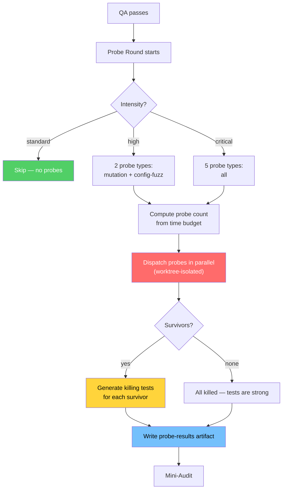

# Adversarial Probe Framework

> Mutation testing and config fuzzing via worktree-isolated probe agents. Spec: `.correctless/specs/adversarial-probe-framework.md`. Architecture: ABS-034, ENV-010.

## What It Does

Tests that pass prove the implementation satisfies assertions — but not that those assertions would catch bugs. A test suite can have 100% coverage and still miss every real-world defect if the assertions are weak.

The adversarial probe framework introduces a "probe round" to `/ctdd` that spawns agents in isolated git worktrees, applies adversarial modifications to the implementation, and runs the test suite against each modification. Surviving probes (tests still pass after the modification) expose weak spots in the test suite. For each survivor, the orchestrator attempts to generate a killing test.

## When It Runs

The probe round executes between QA and mini-audit in the `/ctdd` pipeline, at high+ intensity only:

```
RED -> Test Audit -> GREEN -> /simplify -> QA -> [Probe Round] -> Mini-Audit -> Done
```

Standard intensity skips the probe round entirely (PRH-002).

## Probe Types

| Probe Type | Intensity | What It Does |
|-----------|-----------|--------------|
| **Mutation** | high+ | Swaps operators, removes guards, changes boundary conditions, alters return values in implementation files |
| **Config/Input Fuzz** | high+ | Generates edge-case inputs (empty strings, nulls, malformed JSON, unicode, paths with spaces) for identified input surfaces |
| **Dependency Sabotage** | critical | Removes or downgrades dependencies to test resilience |
| **Permission Stripping** | critical | Removes file/network permissions to test graceful degradation |
| **Rollback Simulation** | critical | Reverts recent implementation changes to test backward compatibility |

## How It Works



### Worktree Isolation (ENV-010)

Every probe agent runs in its own git worktree at `.claude/worktrees/agent-{id}`. This provides:

- **Safety**: No probe modification can corrupt the main working tree
- **Independence**: Each probe gets a clean copy of the codebase
- **Hook bypass**: Workflow hooks (workflow-gate, sensitive-file-guard) do not run inside worktrees — probes have unrestricted write access within their worktree
- **Cleanup**: Worktrees without changes are auto-cleaned by Claude Code; those with changes persist until manual removal

### Budget-Controlled Dispatch

The probe count is derived from a time budget:

```
probe_count = floor(budget_minutes * 60 / test_duration_estimate)
```

Where `test_duration_estimate` defaults to `commands.test_timeout / 3` (fallback: 100s).

- **Interactive mode**: user is prompted for budget in minutes
- **Autonomous mode** (`/cauto`): 15 minutes at high, 30 minutes at critical

All probes dispatch in a single parallel batch. There is no mechanism to cancel in-flight probes — "budget exhausted" means a probe was not dispatched, not that a running probe was killed.

### Test Generation

For mutation and config-fuzz survivors at high intensity, the orchestrator spawns a test-generation agent that:

1. Receives the survivor description (what was modified, what behavior was expected to break)
2. Does NOT receive the worktree path or mutated code (DD-008 — agent separation principle)
3. Writes a killing test in one attempt (no convergence loop — DD-003)
4. In interactive mode: requires human approval before commit
5. In autonomous mode: auto-commits per TB-004 delegation

Critical-only probe survivors (dependency sabotage, permission stripping, rollback simulation) report findings only — no test generation (DD-006). These expose resilience gaps, not assertion gaps.

## Probe Results Artifact (ABS-034)

Written to `.correctless/artifacts/probe-results-{branch-slug}.json`:

- **Schema version**: `schema_version: 1` (additive-only for forward compatibility)
- **Sole writer**: `/ctdd` orchestrator (probe round section)
- **Committed**: yes, via TB-004c allowlist modification in `/cauto` Step 8.1
- **Consumers**: future `/cmetrics` (mutation kill rate trend), `/cdashboard` (probe results panel)
- **Degradation**: consumers MUST show "no probe data" when absent (PAT-019 dormant)

## Design Decisions

| Decision | Rationale |
|----------|-----------|
| Internal orchestration, not a pipeline step (DD-001) | Adding to the canonical step enum would break manifest compatibility |
| One mutation per worktree (DD-002) | Compound mutations make it impossible to identify which change tests missed |
| No convergence loop (DD-003) | Either the LLM writes the killing test or the survivor is reported as a finding |
| Parallel dispatch (DD-004) | Sequential probes with 5-minute test suites would be unusably slow |
| Probe failures never block pipeline (PRH-003) | Advisory-only; infrastructure issues skip to mini-audit |
| ABS-010 exception for inline Agent prompts (DD-009) | `isolation: "worktree"` only available on Agent tool, not Task |

## Relationship to Other Features

- **TDD Mini-Audit** (2026-04-18): Probe round runs before mini-audit. Both are advisory phases within `/ctdd`.
- **Integration Test Contracts** (2026-04-18): Probes validate whether contract-compliant tests actually catch mutations in the exercised paths.
- **Harness Fingerprint** (2026-04-26): Probe results tracked per `{model}+{HARNESS_VERSION}` for cross-model regression detection.
- **Pipeline Completeness Verification** (2026-05-08): Probe round is not in the manifest step enum — it is internal orchestration like `/simplify`.
