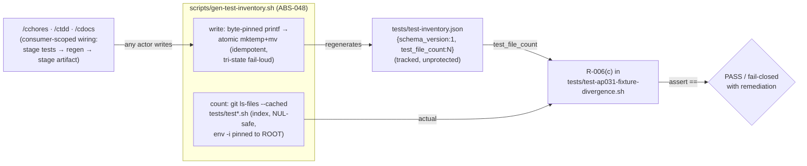

# Generated test-count artifact (agent-context-count-sync, #219)

## What it does

Decouples the authoritative **test-file count** from the `/cchores`
INV-010-protected prose docs. The count now lives in a tracked, unprotected,
**generated** artifact — `tests/test-inventory.json` — that any actor (`/cchores`,
`/ctdd`, `/cdocs`, a human, CI) can regenerate freely. This breaks the GitHub
**#219 deadlock**: a `/cchores` fix whose TDD repro is a net-new test file bumps
the on-disk count, but the one edit that used to clear the resulting staleness —
bumping a number inside `AGENT_CONTEXT.md` — is INV-010-forbidden, so the verified
fix aborted. With the count in a generated file, no protected doc needs editing.

**INV-010 is left completely unchanged** — no shared-doc exception, no
diff-forensics, no count-sync writer, no SFG affordance. The whole class of
hazards that a cross-model (codex) review flagged against an exception-based
approach (worktree-vs-branch-diff bugs, gameable unlock preconditions,
patch-parsing brittleness) is moot because there is no exception to bound.

## How it works



- **Single shared count command (INV-002).** `count` is the only place "actual" is
  computed, over the git **index** (`git ls-files --cached -z -- 'tests/test*.sh'`,
  direct children only, NUL-delimited end-to-end, `env -i` clear-and-allowlist so no
  ambient `GIT_*` var can redirect it, pinned to the repo root resolved from the
  script's own `${BASH_SOURCE[0]}` via a marker-confirmed two-layout discriminator).
  R-006(c) obtains "actual" only from `count`, so writer and consumer can never drift.
- **Deterministic + idempotent (INV-001).** `write` emits a byte-pinned `printf`
  form (no timestamp, not jq-formatted → identical bytes across jq 1.7/1.8 and
  platforms); a no-op regen rewrites no bytes (same inode/mtime), preventing churn.
- **Atomic + fail-loud (INV-003).** Glob-safe dotfile `mktemp` in `tests/` + `mv -f`,
  trap cleanup on the full fatal-signal set; tri-state exit — `0`+success /
  `0`+`no change` / non-zero + a `gen-test-inventory: FAILED <reason>` stdout token
  the callers echo verbatim.
- **Consumer-scoped wiring (INV-006).** Regeneration runs only where the R-006(c)
  consumer marker `tests/test-ap031-fixture-divergence.sh` exists (a generator-side
  no-op guard PLUS per-skill wiring). The staging order is load-bearing: stage the
  new test files → regenerate → stage the artifact → commit (so the index count
  includes the net-new tests). A downstream install with no consumer no-ops
  gracefully — nothing is created or staged.

## Usage

```bash
# Print the authoritative count (the value R-006(c) checks against):
bash scripts/gen-test-inventory.sh count

# Regenerate the artifact after adding/removing tests/test-*.sh files:
bash scripts/gen-test-inventory.sh write && git add tests/test-inventory.json
```

The three skills that add/remove test files (`/cchores`, `/ctdd`, `/cdocs`) do this
automatically, consumer-scoped, with the installed-path form and a source-form
fallback for the pre-install window.

## Known limitations / non-goals

- **Not a sole-writer, not SFG-protected — by design (ABS-048).** The artifact must
  stay unprotected so every actor can regenerate it; adding SFG protection or
  sole-writer enforcement re-introduces the #219 deadlock. A future audit must not
  "correct" the missing protection.
- **Not a tamper control.** R-006(c) is a count/reality *consistency* gate — a chore
  that deletes a real test passes cleanly (the count syncs down). Test-deletion
  detection remains `scripts/security-scan.sh`'s domain.
- **Two parallel count gates are out of scope** (`CONTRIBUTING.md` via
  `test-architecture-drift.sh` AP-005, and `prune-scan.sh scan_counts`). They are
  pre-existing, separate, and non-deadlocking; unifying them is a future cleanup.
- **The `AGENT_CONTEXT.md` Tests-row is now informational** (`~N test scripts` +
  pointer, INV-007) — its digit-anchored `prune-scan` candidate is intentionally
  suppressed by the `~` prefix.

See the spec (`.correctless/specs/agent-context-count-sync.md`) and ABS-048 in
`docs/architecture/abstractions.md` for the full rule set.
