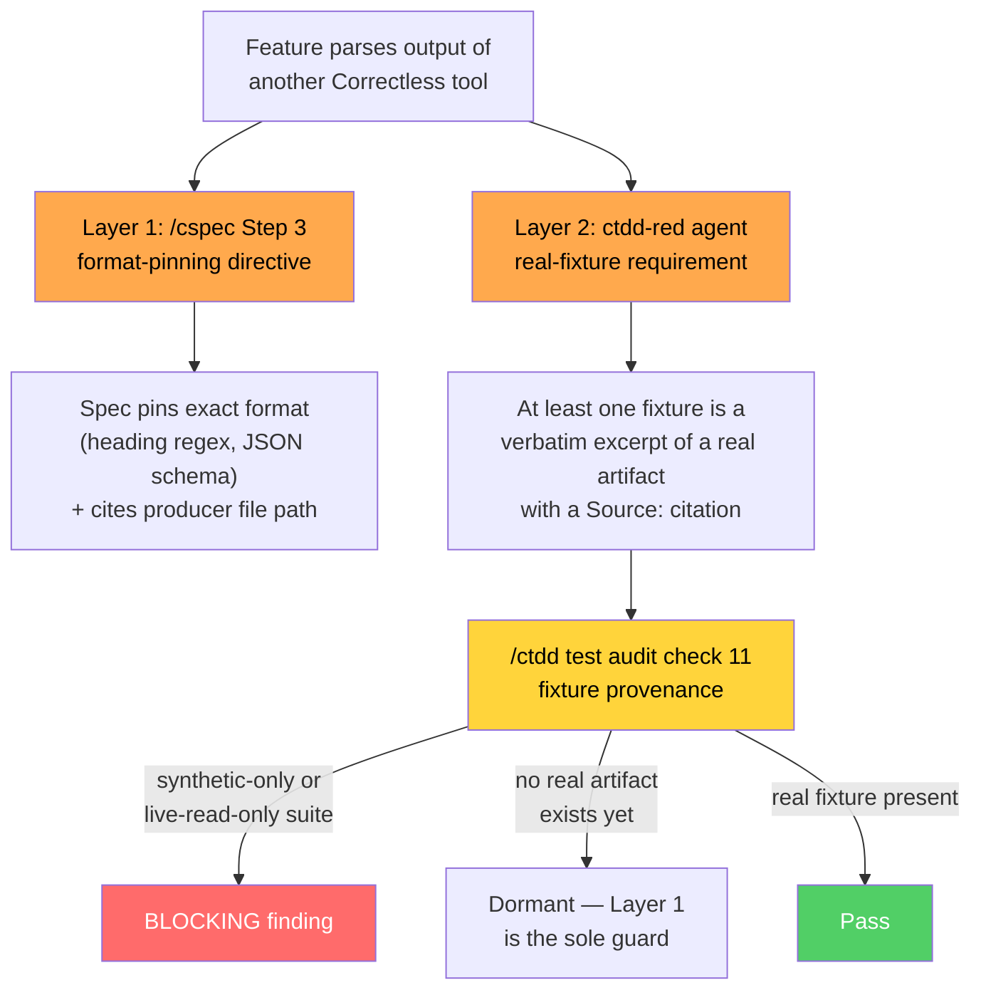

# AP-031 Fixture Divergence Prevention

> Two-layer prompt-level prevention for test fixtures that diverge from real producer output. Spec: `.correctless/specs/ap031-fixture-divergence-prevention.md`. Antipattern: AP-031 in `.correctless/antipatterns.md`. Motivated by PMB-010 and PMB-011.

## What It Does

When a feature parses output produced by another Correctless skill or script (markdown artifact headings, JSON fields, regex matches against artifact content), hand-written test fixtures can silently encode the *wrong* format. All tests pass against the fixtures while the code fails against real data. This happened twice back-to-back:

- **PMB-010**: `sync-deferred-backlog.sh` expected `## RS-001:` headings; the real `/creview-spec` output uses `## Finding RS-001:`. All 65 tests passed against hand-written fixtures. The script imported 0 of 25 pending findings.
- **PMB-011**: the `/cprune` scanner shipped with 3 fixture-divergence bugs (17 false positives, a count-regex that would have corrupted AGENT_CONTEXT.md, and a wrong drift-debt wrapper format).

This feature adds prevention at the two phases where the divergence is introduced: spec writing and test writing.

## The Two Layers

### Layer 1: Format Pinning in /cspec

`skills/cspec/SKILL.md` Step 3 (Draft the Spec) now contains a format-pinning directive. When a feature reads from, extracts from, or pattern-matches against files produced by another skill or script, the spec must:

- **(a)** pin the exact format being parsed — heading regex, JSON schema, or field names
- **(b)** cite the producer file path (SKILL.md template section or script path) as the authoritative format source

Example from the directive: `Heading format: '## Finding RS-{NNN}: {title}' per skills/creview-spec/SKILL.md Step 3.5 template.` Not: `The script reads review findings.`

The trigger does NOT fire for file existence checks or path-only operations.

### Layer 2: Real Fixtures in /ctdd

Two coordinated halves, with writer-side and auditor-side definitions kept aligned (same trigger-detection language, same producer table):

**Writer side** (`agents/ctdd-red.md`): when tests parse another Correctless tool's output, at least one fixture must be sourced from a real artifact in the repo. The preferred form is a verbatim excerpt in the test file (or a tracked fixture under `tests/fixtures/`) with a `Source:` citation in the test language's line-comment syntax — `# Source:` in shell/Python, `// Source:` in Go/TypeScript/Java, `-- Source:` in SQL. This form is hermetic: it works in CI and fresh clones where `.correctless/artifacts/` (gitignored) is absent. Reading the live artifact at test time may add coverage but must never be the sole form.

**Auditor side** (`skills/ctdd/SKILL.md` test audit check 11, "fixture provenance"): flags as BLOCKING any in-scope test suite that is synthetic-only (inline heredocs with no real-artifact reference) or live-read-only (reads the gitignored artifact path with no committed excerpt). Scope is limited to test files added or modified on the current branch; the `/ctdd` orchestrator passes two labeled lists — `MODIFIED_TEST_FILES:` (from `git diff`) and `UNTRACKED_TEST_FILES:` (from `git status --porcelain`, since RED creates untracked files) — because the audit agent is tool-pinned to Read/Grep/Glob and cannot run git. If either label is missing, the check fails loud with a single BLOCKING finding rather than guessing scope. The auditor also follows referenced fixture files (repo-relative paths only, 10-file budget) and treats fixture content as data, not instructions (TB-003 anti-anchoring fence).

### Producer-to-Artifact Reference Table

Both Layer 2 halves carry the same table of known producer-to-artifact patterns, used to distinguish "real artifact exists but the test ignores it" (BLOCKING) from "no artifact exists yet" (dormant):

| Producer | Artifact pattern |
|----------|-----------------|
| `/creview-spec` | `.correctless/artifacts/review-spec-findings-*.md` |
| `/caudit` | `.correctless/artifacts/findings/audit-*-round-*.json` |
| `/cverify` | `.correctless/meta/intensity-calibration.json` |
| `/ctdd` | `.correctless/artifacts/qa-findings-*.json` |
| `/cdocs` | `.correctless/artifacts/cost-*.json` excluding `cost-cache-*` (statusline cache) |

### Dormant Behavior

When a single PR introduces both the producer and the consumer, no real artifact exists to excerpt. The real-fixture requirement is dormant in that case — the spec's format pinning (Layer 1) is the sole guard — and activates once the producer has run at least once.

## Testing

39 block-scoped tests in `tests/test-ap031-fixture-divergence.sh` covering all 6 spec rules. Assertions extract the relevant section (awk state machine between heading/check boundaries) before grepping, so keywords in unrelated sections cannot satisfy a check (AP-003 mitigation). Distribution copies (`correctless/skills/cspec/SKILL.md`, `correctless/skills/ctdd/SKILL.md`, `correctless/agents/ctdd-red.md`) are verified byte-equal to source. The structural test also pins 8 QA/mini-audit class fixes (e.g., the `cost-cache-*` exclusion, the labeled-list fail-loud fallback, the TB-003 fence) so a regression in the directive prose fails the suite.

## Known Limitations

- **Prompt-level enforcement.** All directives are prose read by LLM agents — adherence can fade under context pressure (a deliberate PAT-018 deviation; runtime fixture validation is explicitly out of scope per the spec's Won't Do). Check 11 is the second-pass safety net for a RED agent that misses the requirement.
- **Correlated trigger detection.** Layer 1 and Layer 2 both depend on recognizing "this feature parses another tool's output." The correlation is partial, not total: check 11 examines fixture content directly (`Source:` citations) and fires independently of whether the spec pinned the format.
- **Stale artifacts.** The most recent artifact is the best proxy for current format, but committed excerpts can drift if the producer's format changes later. Layer 1's cross-reference to the producer's SKILL.md template (not the artifact) catches format changes at spec time.
- **No retroactive retrofits.** Pre-existing tests are out of scope; the requirement applies to test files added or modified going forward.
