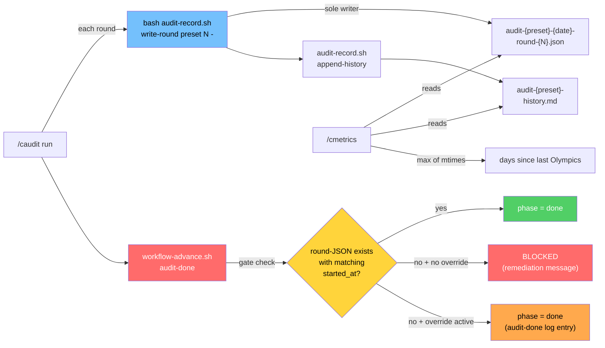

# Audit Findings Persistence Contract

> Gate-enforced persistence for `/caudit` round-JSON and history.md artifacts. Spec: `.correctless/specs/audit-findings-persistence-contract.md`. Architecture: ABS-029. Antipattern guarded: AP-026.

## What It Does

`/caudit` historically described its persistence step in skill prose: write per-round findings to `.correctless/artifacts/findings/audit-{preset}-{date}-round-{N}.json` and append a run summary to `audit-{preset}-history.md`. Nothing enforced it.

On 2026-04-26 the orchestrator ran `/caudit hacker`, produced ~22 findings, addressed them via the harness-fingerprint R2 hardening PR, called `audit-done`, and the workflow phase transitioned to `done` cleanly — but neither the round-JSON nor the history append was written. Findings existed only as commit-message prose on the squash-deleted audit branch. `/cmetrics` then derived "days since last Olympics" from the history.md mtime (last touched 2026-04-04) and reported the audit as 16 days stale when it had run the day before.

This feature ships three bundled mechanisms that close the gap structurally:

1. **`cmd_audit_done` precondition gate** (`hooks/workflow-advance.sh`) — refuses the transition to `done` unless at least one round-JSON exists whose `started_at` field equals the workflow state's `started_at`. Content-based string equality, not mtime — robust to ENV-003 timestamp drift after `git checkout`/`git clone`/`git rebase`.
2. **`scripts/audit-record.sh`** — sole writer for round-JSON files and history.md appends. PAT-003 phase-transition CLI: `write-round` and `append-history` subcommands, sources `lib.sh`, exits 0 on success non-zero on failure. Sensitive-file-guard protected against autonomous Edit/Write (AP-022 mitigation, harness-fingerprint precedent).
3. **`/cmetrics` multi-signal staleness** — derives "days since last Olympics" as `max(history.md mtime, latest round-JSON mtime)`, with an explicit "no data" label when both signals are absent. A separate audit-done override counter surfaces routine-override drift on this gate specifically (AP-023).

## How It Works



### The Gate's Match Algorithm

```bash
# Roughly what cmd_audit_done does (see hooks/workflow-advance.sh:788-890)
preset=$(jq -r '.audit.type'    state_file)   # validate: ^[a-z][a-z0-9-]{0,31}$
state_started=$(jq -r '.started_at' state_file)
for f in .correctless/artifacts/findings/audit-${preset}-*-round-*.json; do
  file_started=$(jq -r '.started_at' "$f")
  [ "$file_started" = "$state_started" ] && matched=1 && break
done
[ -z "$matched" ] && die "ABS-029 gate"
```

`started_at` is frozen at `audit-start` and never re-stamped on phase re-entry (EA-001a) — so an audit started at 23:55 and completed at 00:05 the next day is accepted regardless of whether the round-JSON's `date` suffix reads yesterday or today. The content match is the only load-bearing signal; filesystem mtime, the date suffix in the filename, and `phase_entered_at` are explicitly NOT used.

### Round-JSON Schema

Required fields (INV-002):

| Field | Type | Notes |
|-------|------|-------|
| `preset` | string | matches the path's `{preset}` |
| `date` | string | `YYYY-MM-DD` exactly |
| `round` | integer | positive |
| `findings` | array | may be empty |
| `rejected` | array | may be empty |
| `started_at` | ISO-8601 UTC | `YYYY-MM-DDTHH:MM:SSZ` (literal `Z`, never `+00:00`) — matches workflow state |

Optional fields (`specialist_lenses`, `deferred`, `findings_count`, etc.) are preserved if present in the input.

### Zero-Finding Audits

A clean run (zero findings after Round 1 specialists) MUST still write `audit-{preset}-{date}-round-1.json` with `findings: []` and `rejected: []`. The empty-findings file IS the audit's evidence of having run; absence is NOT evidence of "no findings." `/caudit` invokes:

```bash
echo '{"findings": [], "rejected": []}' | \
  bash scripts/audit-record.sh write-round qa 1 -
```

The script merges schema-required fields (`preset`, `date`, `round`, `started_at`) and writes the canonical path. `audit-record.sh` rejects TTY stdin with a clear error rather than blocking — preventing interactive-test hangs.

## Configuration

No project-level config knobs. The contract is hardcoded:

- Path format: `.correctless/artifacts/findings/audit-{preset}-{date}-round-{N}.json`
- Schema: see table above
- Sole writer: `scripts/audit-record.sh` (and `.correctless/scripts/audit-record.sh` install mirror — both protected by `hooks/sensitive-file-guard.sh` DEFAULTS)
- Sole invoker of `write-round`: `/caudit` (PRH-001 — structural test enforces)

## Examples

**Block on missing artifact:**

```
$ bash hooks/workflow-advance.sh audit-done
BLOCKED: Audit findings missing — no round-JSON for this run found.
  Expected file pattern: audit-qa-*-round-*.json
  Required match: started_at = 2026-04-30T03:09:20Z
  Remediation: bash .correctless/scripts/audit-record.sh write-round qa <round> <findings>
ERROR: cmd_audit_done refused: ABS-029 gate
```

**Override bypass (logged with audit-specific entry):**

```
$ bash hooks/workflow-advance.sh override "stale install — script missing"
$ bash hooks/workflow-advance.sh audit-done
# phase advances to done
# .correctless/artifacts/override-log.json gains:
# {"timestamp": "...", "gate": "audit-done",
#  "reason": "Audit findings missing — overridden (ABS-029 gate)",
#  "bypass_target": "cmd_audit_done"}
```

The audit-done override is counted separately from generic audit-phase overrides so `/cmetrics` Override Health can flag routine bypasses on this gate specifically.

**Legacy round-JSONs:**

Files at `.correctless/artifacts/findings/audit-*-round-*.json` that predate this contract lack `started_at` and CANNOT satisfy the gate. Developers with an in-flight audit at the time this PR lands either re-run `/caudit` to produce a contract-compliant artifact or use the standard `--override` escape hatch. No reconstruction or `started_at` back-fill is offered (per the spec's Q2 brainstorm decision — fabricated history is worse than acknowledged gap).

## Known Limitations

- **Spoofing/Tampering not addressed.** The gate enforces presence, not authenticity. An agent that wants to fake an audit can already do so (fake commits, fake specs, etc.) — the persistence contract closes the silent-omission class only. If tampering becomes a real concern, sensitive-file-guard protection of `findings/` paths is the natural follow-up.
- **AP-003-class structural-test limits on INV-006/PRH-005.** Two structural tests grep skill prose for the sole-writer / multi-signal patterns; the spec acknowledges grep can produce false negatives on rephrased text. Behavioral tests (`test_inv005_max_picks_newer_signal` and PRH-001's command-name grep) are the load-bearing complementary signals.
- **`/cmetrics` is fail-open and mtime-based.** ENV-003 says filesystem mtime is unreliable after git ops. The consumer side accepts this — a stale mtime produces a slightly-wrong staleness number but does not corrupt workflow state. The gate is content-based and immune. Layer separation is intentional.

## See Also

- Spec: `.correctless/specs/audit-findings-persistence-contract.md`
- Architecture entry: `.correctless/ARCHITECTURE.md` ABS-029
- Antipattern: `.correctless/antipatterns.md` AP-026
- Postmortem: PMB-005 in `.correctless/antipatterns.md` and `CLAUDE.md` Correctless Learnings
- Tests: `tests/test-audit-findings-persistence.sh` (43 tests, all passing)
- Sole writer: `scripts/audit-record.sh`
- Gate: `hooks/workflow-advance.sh:788` `cmd_audit_done`
- Consumer: `skills/cmetrics/SKILL.md`
- Caller: `skills/caudit/SKILL.md`
