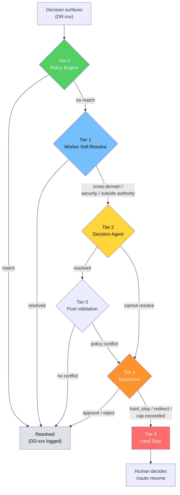
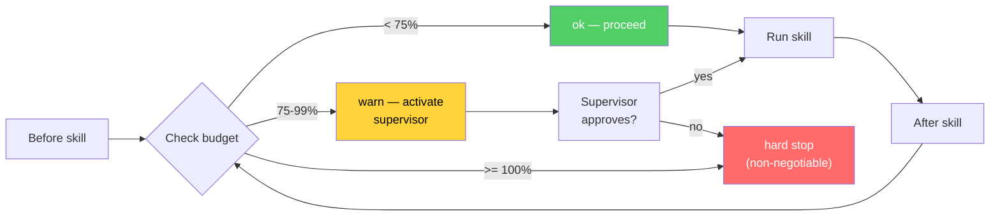

# Auto Mode Phase 2: Policy-Driven Decision Engine

## What Phase 2 Adds

Phase 1 (`/cauto`) orchestrated the implementation pipeline with human escalation on any decision the agent could not self-resolve. Phase 2 replaces the binary "do it or escalate" model with a **tiered decision architecture** that resolves most runtime decisions autonomously while preserving hard stops for security, budget, and ambiguity.

Key additions:

- **Tier 0 policy engine** — deterministic, config-driven decision resolution with no LLM reasoning. Configured via `auto-policy.json`.
- **Tier 1 worker self-resolution** — within-domain decisions resolved by the executing skill with mandatory logging.
- **Tier 2 ephemeral decision agents** — spawned with minimal context (`context: fork`), tools pinned to `{Read, Grep, Glob}`, no state between invocations.
- **Tier 3 lightweight supervisor** — activates on escalation, phase transitions, and budget warnings. Cap of 20 activations per run.
- **Tier 4 hard stop** — structured decision request for the human with numbered options and a resume command.
- **Budget enforcement** — token and time limits with warn/hard-stop thresholds, checked before and after each skill invocation.
- **Decision record** — append-only DD-xxx entries with size-regression detection and post-pipeline cardinality verification.
- **Intent summary** — immutable artifact written once at pipeline start, SHA-256 hash verified on each supervisor activation.
- **Auto Run Report** — 12-section report generated on completion or pause, including hedging scan and ASSUMPTION-tagged decisions.

## Tier Architecture



**Key properties:**
- Tier 0 is pure conditional logic — no LLM involved, deterministic, dual-pass (pre-routing and post-Tier-2 validation).
- Tier 2 agents are ephemeral — fresh context each invocation, no Write/Bash/Task tools, terminated after returning.
- Tier 3 supervisor uses `context: fork` on every activation — no accumulated state.
- Tiers cannot be skipped — Tier 1 cannot jump to Tier 3 without Tier 2 evaluation.

## How to Use

### Prerequisites

1. A spec must be written (`/cspec`) and reviewed (`/creview`).
2. `auto-policy.json` must exist (scaffolded by `/csetup`).

### Running

```
/cauto
```

The pipeline runs: `ctdd -> simplify -> cverify -> cupdate-arch -> cdocs -> PR`.

Phase 2 handles most decisions autonomously. If a hard stop fires:

```
/cauto resume "option 1"
```

Or provide a free-text response:

```
/cauto resume "fix the security finding but defer the performance one"
```

### After Completion

The Auto Run Report at `.correctless/artifacts/auto-report-{slug}.md` contains:
- Status (COMPLETE, PAUSED, BUDGET_EXCEEDED, TIME_EXCEEDED)
- Decisions requiring human review (ASSUMPTION-tagged + hedging-scan candidates)
- "What to Review First" prioritized list
- Full decision summary by tier

## Configuration

### auto-policy.json Schema

Located at `.correctless/config/auto-policy.json`. Protected by sensitive-file-guard (human-edit only).

| Section | Purpose |
|---------|---------|
| `review_dispositions` | How to handle review findings by category |
| `qa_dispositions` | How to handle QA findings by severity |
| `spec_update` | Limits on autonomous spec revisions |
| `drift` | How to handle verification drift |
| `security` | `never_relax_autonomously: true` (hardcoded, not overridable) |
| `budget` | Token limits with warn/hard-stop percentages |
| `time` | Wall-clock time limits |
| `ambiguity_policy` | `conservative` (default), `pause`, or `best_judgment` |
| `hard_stops` | Conditions that always trigger Tier 4 |

**Category vocabulary:** `security`, `availability`, `testability`, `scope_expansion`, `performance`, `architecture`, `observability`, `technical_debt`.

**Disposition vocabulary:** `fix`, `defer`, `defer_to_report`, `add_rule`, `tier2_decide`, `escalate_supervisor`, `hard_stop`, `log_as_debt`.

### Budget Enforcement



Token budget defaults: warn at 75%, hard stop at 100% of `max_tokens` (default 2M). Time budget: warn at 6 hours, hard stop at 8 hours.

Before spawning a Tier 2 agent, if remaining token budget is < 5%, the orchestrator escalates directly to Tier 3 instead.

## Integrity Enforcement

Three artifacts are hash-verified throughout the run:

| Artifact | Hash stored in | Verified on |
|----------|---------------|-------------|
| Intent summary | Workflow state | Every supervisor activation, every resume |
| Auto-policy.json | Workflow state | Every Tier 0 evaluation (both passes) |
| Decision record | Workflow state (size) | Every append (size-regression check) |

Hash chain: `sha256sum` -> `shasum -a 256` -> `openssl dgst -sha256` -> graceful skip (PAT-011).

## Known Limitations (Phase 3 Scope)

- **No autonomous spec writing** — human still writes the spec
- **No autonomous spec review** — human still approves review
- **No notification channels** — budget warnings are discovered post-run via the Auto Run Report
- **No policy learning** — policy rules are static, not calibrated from past decisions
- **No parallel skill execution** — pipeline is sequential
- **No custom pipeline ordering** — fixed sequence
- **PID-based lockfile** — assumes single-machine execution; Factory mode will need distributed locks

## New Scripts

| Script | Functions |
|--------|-----------|
| `scripts/auto-policy.sh` | `policy_parse()`, `policy_evaluate()`, `policy_hash()` |
| `scripts/auto-report.sh` | `report_generate()`, `report_section_decisions()`, `report_section_implementation()` |
| `scripts/budget-check.sh` | `budget_get_token_usage()`, `budget_get_elapsed()`, `budget_check()`, `escalation_write()`, `resume_parse_decision()` |
| `scripts/cauto-lock.sh` | `lock_acquire()`, `lock_release()`, `lock_check_stale()` |
| `scripts/decision-record.sh` | `drx_validate()`, `dr_append()`, `dr_count_entries()`, `dr_verify_size()`, `dr_hedging_scan()`, `dr_verify_cardinality()` |
| `scripts/decision-routing.sh` | `validate_tier_hierarchy()`, `route_decision()`, `supervisor_validate_input()`, `supervisor_validate_response()`, `check_supervisor_cap()` |
| `scripts/intent-hash.sh` | `intent_hash()`, `intent_create()`, `intent_verify()` |
| `scripts/security-scan.sh` | `security_category_gate()`, `security_keyword_scan()`, `security_structural_guard()`, `check_test_deletion()`, `check_override_usage()` |
| `scripts/workflow-state-ext.sh` | `ws_get_field()`, `ws_set_field()`, `ws_increment_field()` |

## New Agents

| Agent | File | Purpose |
|-------|------|---------|
| supervisor | `agents/supervisor.md` | Tier 3 lightweight supervisor. Tools: Read, Grep, Glob. `context: fork` per activation. |
| decision-agent | `agents/decision-agent.md` | Tier 2 ephemeral decision agent. Tools: Read, Grep, Glob. `context: fork`, terminates after each response. |

## Architecture References

- ABS-011: Decision record contract
- ABS-012: Intent summary contract
- ABS-013: Auto Run Report contract
- ABS-014: Pending-decision checkpoint
- ABS-015: Pipeline lockfile
- ABS-016: Auto-policy config
- ABS-017: Structured decision request (DR-xxx)
- PAT-011: SHA-256 hash verification chain
