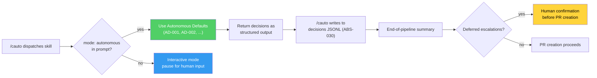

# Autonomous Skill Contract

> Added: 2026-05-08 | Spec: `.correctless/specs/autonomous-skill-contract.md` | Intensity: high

## What It Does

Every skill now declares how it behaves when dispatched by `/cauto`: interactively (pausing for human input), autonomously (applying sensible defaults), or hybrid (some decisions autonomous, some always-escalate). The `interaction_mode` frontmatter field in each SKILL.md encodes this contract.

When `/cauto` runs a skill, it passes `mode: autonomous` in the task prompt. Skills detect this flag and use their documented defaults instead of pausing. Every autonomous decision is returned as structured output and logged to a JSONL artifact for end-of-pipeline review.

## How It Works

## Skill Classification

| Mode | Count | Description | Examples |
|------|-------|-------------|----------|
| `autonomous` | 5 | Run to completion without human input | chelp, cmetrics, cstatus, csummary, cwtf |
| `interactive` | 2 | Require Socratic human interaction | csetup, cspec |
| `hybrid` | 22 | Have decision points with defaults; some always-escalate | ctdd, cdocs, cverify, caudit, cauto, ... |

Four `hybrid` skills also have `context: fork` (cdevadv, cpostmortem, credteam, cverify). These cannot receive follow-up input when forked, so `escalate: always` decisions use the deferred escalation mechanism (R-011): apply the default, flag it, and surface it at pipeline conclusion for human review.

## Decision Logging

`/cauto` is the sole writer of `.correctless/artifacts/autonomous-decisions-{branch_slug}.jsonl` (ABS-030). Skills return decisions in a structured block; `/cauto` persists them via `scripts/autonomous-decision-writer.sh`. The writer script follows the same SFG-bypass pattern as `audit-record.sh` (ABS-029).

Each entry records: skill name, decision ID (AD-xxx or AD-UNLISTED-N), default applied, rationale, whether escalation was deferred, and the original escalation reason if applicable.

## Configuration

No configuration required. The `interaction_mode` field is documentation-only -- it is not parsed by the Claude Code plugin loader (ENV-007). `/cauto` reads it via the Read tool when determining dispatch behavior.

## Known Limitations

- **AD-UNLISTED accumulation**: If many decisions hit the AD-UNLISTED fallback (R-014), the skill's `## Autonomous Defaults` section is incomplete. Unlisted decisions appear prominently in the deferred escalation summary.
- **Default quality**: Autonomous defaults may become stale as the project evolves. Defaults are visible in interactive mode too (R-008 `(default)` annotations), providing natural feedback.

## References

- Spec: `.correctless/specs/autonomous-skill-contract.md` (14 rules)
- ABS-030 in `.correctless/ARCHITECTURE.md`
- Tests: `tests/test-autonomous-skill-contract.sh` (70 assertions)
- Writer script: `scripts/autonomous-decision-writer.sh`
