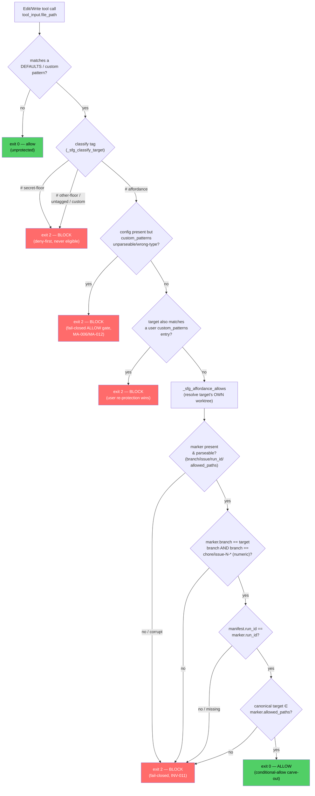

# /cchores Protected-File Affordance (PRH-003 v2)

> `/cchores` can now fix SFG-protected files — but ONLY a conservative, non-security subset, ONLY when a human explicitly invokes `/cchores <N>` with an issue number, and ONLY through a branch- and file-scoped per-run authorization marker. Spec: `.correctless/specs/cchores-protected-affordance.md`. Architecture: ABS-049 (See-links ABS-045, the SFG capability boundary). Rule carve-outs: `.claude/rules/hooks-pretooluse.md` (second exception), `.claude/rules/sfg-deliverable.md` (new AP-037 deliverable). Antipattern honesty: AP-040 / PMB-020.

## What It Does

`/cchores` was fail-closed against every `sensitive-file-guard.sh` (SFG) protected file: any issue whose fix targeted a DEFAULTS path aborted at pre-selection, and any post-`/cdebug` diff touching a protected path aborted before the PR. A 2026-07-06 no-op run found **13 of 53** candidate bugs blocked by that guard — a large share of the repo's own backlog was unreachable to autonomous chores.

This feature is the v2 unblock. It lets `/cchores` fix a protected file **only under an explicit-issue authorization marker**, gating three things at once:

1. **Mode** — the affordance is active only when a human runs `/cchores <N>` (explicit issue number = tacit authorization). No-arg auto-select mode is byte-for-byte unchanged v1 (still aborts on any protected target), because that path is injection-exposed through untrusted issue *selection*.
2. **Eligibility** — only a conservative, non-security **`# affordance`** subset of DEFAULTS is reachable. Secrets, security/sole-writer guards, `scripts/lib.sh`, and run-state artifacts are never eligible.
3. **Scope** — a per-run marker binds the authorization to the exact chore branch, the specific file paths, and a per-run `run_id` nonce, so protection is never globally lifted.

SFG remains a **cooperative-loop guardrail, not a security perimeter** (AP-040 / PMB-020). It inspects only the Edit/Write tool-path and never Bash, so a motivated injection can still Bash-evade it. The affordance does not make SFG more evadable and makes no claim to stop injection — the load-bearing backstops stay outside SFG (see Known Limitations).

## How to Use

| Invocation | Behavior |
|------------|----------|
| `/cchores` (no arg) | v1 unchanged. Auto-selects one suitable issue. Any SFG-protected fix target aborts at pre-selection; any protected path in the post-`/cdebug` diff aborts before the PR. Never mints a marker. |
| `/cchores <N>` (explicit) | v2 affordance. The human's explicit issue number is the authorization. If issue N's fix targets an `# affordance`-tagged protected path, `/cchores` mints a scoped marker, lets `/cdebug` fix it, and opens a **never-merged** PR carrying the INV-010 review banner. Secrets, non-eligible infra, and out-of-scope paths still abort. |

You never touch the marker or the hook directly — `/cchores` orchestrates the whole lifecycle. Every affordance-mode PR is never-merged (PRH-003) and carries a prominent banner naming the protected path(s) edited and the authorizing issue, escalated when the diff touches the guard itself or `scripts/lib.sh`.

## The 3-Way DEFAULTS Classification

Every line of the SFG `DEFAULTS` block carries exactly one inline tag — the **single source of truth** from which `is_secret_floor()` and `is_affordance_eligible()` derive (never a second enumerated list; the prior `_SFG_LEGACY_EXACT_LINE_MIRROR` was deleted in QA-001):

| Tag | Meaning | Reachable under a marker? | Examples |
|-----|---------|---------------------------|----------|
| `# affordance` | Non-security infra whose fix cannot weaken a security control, a sole-writer contract, SFG's own matching, or run state | **Yes** (with a valid marker) | The only DEFAULTS entries currently tagged eligible are `scripts/prune-scan.sh` and `scripts/harness-fingerprint.sh` (each in all three DEFAULTS forms). Peers of that kind — `build-dashboard.sh`, `gen-test-inventory.sh`, `cross-feature-intel.sh`, `compute-session-cost.sh` — qualify by the inclusion rule but are not in DEFAULTS (not protected), so they carry no tag |
| `# secret-floor` | Keys, credentials, `.env` | **Never** (hard floor, checked first) | `.env`, `*.pem`, `*.key`, `credentials.json`, `id_rsa`, `secrets.*`, `*.keystore` |
| `# other-floor` | Security/sole-writer guards, `lib.sh`, state artifacts, the marker + writer | **Never** | `scripts/override-scrutiny.sh`, `scripts/audit-record.sh`, `scripts/meta-record.sh`, `scripts/lib.sh`, `scripts/wf/*.sh`, the marker |

This is **deny-by-default**: only an explicit `# affordance` tag is eligible. Any `# secret-floor`, `# other-floor`, untagged/newly-added DEFAULTS line, or `custom_patterns` match is floor → BLOCKED. A structural test parses the DEFAULTS block between the anchored `^DEFAULTS="` … `^"$` delimiters, asserts every line is tagged exactly once, and flags any `# affordance` line that looks secret-adjacent.

**Inclusion rule** for a new `# affordance` tag: a fix to the file cannot weaken a security control, a sole-writer contract, SFG's own matching, or run state — otherwise `# other-floor`.

## Marker Lifecycle

The authorization marker `.correctless/artifacts/chores-protected-authorized.json` has schema `{branch, issue, run_id, allowed_paths, authorized_at}`. Its sole cooperative-loop writer is `scripts/chores-authorize.sh` (registered in `scripts/sanctioned-chores-writers.tsv`; the marker + writer three-form are in DEFAULTS as `# other-floor`, and `/cchores` excludes the marker from its `Write(.correctless/artifacts/*)` grant via `disallowed-tools`):

1. **Clear at run start** — `chores-authorize.sh clear` unconditionally removes any pre-existing marker and rotates the `run_id` out of the chore-run manifest.
2. **Capability handshake** — `check-capability` feeds the *installed* hook a known-good marker fixture over a throwaway git repo and confirms it actually allows an affordance write; `/cchores` also confirms both `chores-authorize.sh` and `cchores-diff-check.sh` exist. Absent/stubbed → degrade to v1 with a `bash setup` message (never a mid-run wall).
3. **Mint** — only after the suitability classifier and idempotency re-check pass, `chores-authorize.sh write --issue <N> --allowed-paths <scoped paths>`. The writer **refuses** (non-zero, no marker) unless `--issue <N>` is numeric AND matches the current `chore/issue-<N>-*` branch. It mints a **fresh** `run_id` per run (never reuses a persisted one) and merges it clobber-safely into the real chore-run manifest.
4. **Verify persisted** before `/cdebug` dispatch.
5. **Clear on every terminal path** (PR opened, abort, no-op), under the worktree lock.

The manifest filename is derived via `lib.sh` `branch_slug()` — the same way `/cchores`'s real run manifest is named (ABS-043) — so the SFG `run_id` check binds to the correct file (QA-004 cheap-path alignment).

## The Authority Split

The affordance leans on both a runtime SFG check and a coded `/cchores`-side diff gate. Not all of it is equally trustworthy, and the spec is explicit about which legs are authoritative:

| Leg | Source | Trust |
|-----|--------|-------|
| SFG `# secret-floor` deny-first | DEFAULTS tags (not the marker) | **Authoritative** — a secret is never reachable via naive Edit/Write, regardless of marker/branch/mode |
| `cchores-diff-check.sh` leg (a) secret-floor + leg (b) shared-project-docs | DEFAULTS tags + a fixed doc list | **Authoritative** — marker-independent; aborts even if the path is listed in `allowed_paths` |
| `cchores-diff-check.sh` leg (c) out-of-scope | reads `marker.allowed_paths` | **Guardrail only** — the marker is Bash-forgeable (RS-002), so this stops naive scope-creep, not injection |
| SFG allowlist (branch + `allowed_paths` + `run_id`) | the marker | **Guardrail only** — same forgeability residual |

The authoritative confinement against injection-grade misuse is therefore the marker-**independent** legs (a)+(b) **plus** never-merge (PRH-003) **plus** outbound redaction **plus** the INV-010 human-review PR banner — never the forgeable marker alone.

## The Decision Flow

Every failure or ambiguity path exits **2** (fail-closed); the affordance widens `exit 0` by exactly one precisely-scoped case and leaves the "unexpected input → exit 2" posture (PAT-001 clause 5) intact. The classification helpers are side-effect-free (a `main`-guard makes sourcing the hook a no-op) so `/cchores`'s coded gates can reuse `is_secret_floor()` without triggering the policy body.

## Known Limitations (Accepted Residuals)

These are disclosed, accepted non-goals — not defects. The affordance is honest about what a cooperative-loop guardrail can deliver (AP-040 / PMB-020):

- **Bash-forgeability** — SFG never inspects Bash, so an injected `/cdebug` can Bash-write a floor path (`cat > .env`) or forge the marker on its own legit chore branch. Contained by INV-007's marker-independent legs + never-merge + redaction + human review, not by SFG.
- **Crash-window manual edit** (MA-011) — the per-run `run_id` makes a leaked marker inert against a *later* `/cchores` run, but does NOT close a manual/injected edit on the **same** branch after `write` and before the next run's `clear`, while marker and manifest still share a `run_id`. Accepted alongside the OQ-005 in-tree-write residual; a TTL bound (OQ-003) stays deferred.
- **In-tree write window** (OQ-005) — INV-009 protects PR-reachability (a chore fix can't alter the DEFAULTS classification or allowlist logic and reach a PR), but not the live working tree during the run. Caught before any PR by INV-007/INV-009; never merges.
- **QA-004 escalated (cross-skill schema)** — the affordance binds `marker.run_id` to `/cchores`'s real chore-run manifest by filename today, but the manifest's documented INV-007 schema in `skills/cchores/SKILL.md` (`{schema_version, selected_issue, status, ...}`) does not yet declare a `run_id` field, and minting *ownership* is unratified. A human decision is carried forward: (1) document `run_id` in the INV-007 schema and assign minting ownership to `/cchores`, or (2) ratify `chores-authorize.sh` as the `run_id` owner and document that in INV-007 + INV-005. The affordance works and binds to the correct file today; only the cross-skill contract is undocumented.

See the spec (`.correctless/specs/cchores-protected-affordance.md`) for the full invariant list (INV-001..015, PRH-001..003), STRIDE analysis, and boundary conditions — this page does not duplicate the detailed rules.
