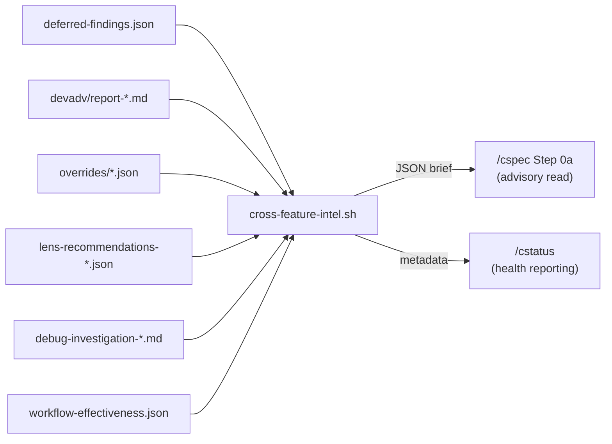

# Cross-Feature Intelligence

> Aggregates historical pipeline data into a scoped brief for `/cspec` brainstorm. Spec: `.correctless/specs/cross-feature-intelligence.md`. Architecture: ABS-037.

## What It Does

The Correctless pipeline generates rich data across features -- deferred review findings, Devil's Advocate themes, override patterns, lens recommendations, debug investigations, and phase effectiveness history -- but each `/cspec` run previously started from a near-blank slate. This feature adds a deterministic aggregation script that synthesizes 6 data sources into a single JSON brief, filtered by file-scope overlap and recency-weighted. `/cspec` reads this brief during the Socratic brainstorm (Step 0a) to surface concerns from prior workflow runs -- as context, not constraints.

## How It Works



The script (`scripts/cross-feature-intel.sh`, 876 lines) reads each source, extracts structured entries, applies recency filtering (90-day exclusion), scope filtering (by affected files), and caps the output at 30 entries with per-section minimums. The output is a single JSON artifact at `.correctless/meta/cross-feature-intel.json`.

## Data Sources

| Source | Location | Entries Extracted |
|--------|----------|-------------------|
| Deferred findings | `.correctless/meta/deferred-findings.json` | Open findings (status = "open") |
| Devil's Advocate | `.correctless/artifacts/devadv/report-*.md` | `## DA-NNN:` headings with severity |
| Overrides | `.correctless/meta/overrides/*.json` | Override entries, collapsed by reason hash |
| Lens recommendations | `.correctless/artifacts/lens-recommendations-*.json` | Recommended lenses, collapsed by name |
| Debug investigations | `.correctless/artifacts/debug-investigation-*.md` | Root cause summaries with file refs |
| Phase effectiveness | `.correctless/meta/workflow-effectiveness.json` | Post-merge bugs by missed phase |

## Usage

The script runs automatically when `/cspec` starts a new feature. To run manually:

```bash
# Unfiltered (all entries)
bash .correctless/scripts/cross-feature-intel.sh --base .correctless

# Scoped to specific files
bash .correctless/scripts/cross-feature-intel.sh --base .correctless --scope "hooks/workflow-gate.sh,scripts/lib.sh"
```

## Key Design Decisions

- **Script over LLM aggregation** (DD-001): deterministic bash is testable and reproducible.
- **Single brief file** (DD-002): one JSON read in `/cspec` instead of 6 fragile separate reads.
- **Anti-anchoring over UNTRUSTED fence** (DD-004): the data is internal project history (human-reviewed at creation), not external untrusted content. The risk is cognitive anchoring, not prompt injection. Calibration examples tell the agent when to weight and when to dismiss.
- **Advisory only** (PRH-001): the brief never gates any phase transition or blocks any skill.

## Configuration

No configuration needed. The script derives all paths from the `--base` argument. The 90-day staleness threshold and 30-entry cap are constants in the script.

## Consumers

- **`/cspec`**: reads during Step 0a brainstorm. Presents 3-5 most recent entries. Framed as context, not constraints. Anti-anchoring directive with calibration examples prevents over-reliance on historical patterns.
- **`/cstatus`**: shows intelligence health in 3 states (no data / stale / current). Dormant on pre-upgrade projects.

## Known Limitations

- File-scope filtering currently applies only to debug investigations (only source with file-scoped data). Other sources are included unconditionally as project-wide concerns.
- Date arithmetic uses file mtime for some sources (devadv reports, debug investigations), which is approximate after git operations (ENV-003).
- The brief is not fed to `/creview` or `/creview-spec` yet (DEFER-001 in the spec).
