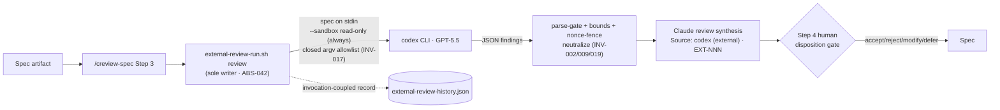

# Cross-Model Spec Review via codex

Activates the dormant external-review path in `/creview-spec` so that **codex
(GPT-5.5)** runs as a first-class adversarial spec reviewer alongside Claude's
six review agents. A different model, a different vendor, and a different failure
distribution — an independent grader for the spec, in the same spirit as the
core "never let an agent grade its own work" principle.

Full rules live in the spec: `.correctless/specs/cross-model-spec-review.md`
(23 invariants). This doc covers behavior, configuration, and limitations only.

## What it does

When `/creview-spec` runs at high+ intensity and an external model is configured,
it invokes the codex CLI **read-only against the whole spec** and folds the
returned findings into the synthesis as `Source: codex (external)`. Codex
findings are **advisory only** — they are renamespaced to `EXT-NNN`, presented to
you at the Step 4 human disposition gate, and never auto-incorporated into the
spec.

When no external model is configured (or the codex binary is absent), the path is
**silently dormant** — `/creview-spec` runs exactly as before with its six Claude
agents. This is the default: nothing turns on until you opt in.

## How it works

The producer (`scripts/external-review-run.sh`) is the **sole writer** of
`.correctless/meta/external-review-history.json` and the run-id-keyed codex output
artifact. It injects `--sandbox read-only` unconditionally (a tampered config
cannot run codex unsandboxed — closes the AP-022 dead-code-in-security-paths
class), validates the entire invocation against a closed allowlist, and parse-gates,
bounds (4 MiB ceiling), and nonce-fences the untrusted codex output before it ever
reaches Claude's reasoning context.

## Configuration

In `.correctless/config/workflow-config.json` under `workflow.external_models.codex`:

| Field | Meaning |
|-------|---------|
| `bin` | Path/name of the codex binary (realpath-validated) |
| `base_args` | Base argv, e.g. `["exec","--ephemeral","--json"]` — `--sandbox`, `--output-schema`, and `--output-last-message` are appended by the producer and rejected if present here |
| `model` | Model id (charset-validated) |
| `timeout` | Clamped per-run timeout |

`/csetup` auto-detects an installed codex CLI and offers to populate this block
(with an egress disclosure). To set fields after setup, use the sanctioned writer:
`scripts/config-update.sh set-external-model …`. `require_external_review: true`
makes external review mandatory rather than flag-triggered.

## Known limitations

- **`/creview-spec`-only.** External review does **not** run in the `/cauto`
  autonomous pipeline — there is no human checkpoint there, so the codex path is
  intentionally excluded.
- **Full-repo egress.** Running codex sends repository content (including any
  secrets, `.env`, and git history within codex's read scope) to OpenAI. This is
  disclosed at configuration time (INV-014) and again per run (INV-022). The
  read-only sandbox bounds *writes*, not *egress* — the egress boundary is the
  opt-in config gate, not the sandbox.
- **Advisory only.** Codex findings never auto-incorporate; every one passes the
  human disposition gate.

## Security boundaries

- **TB-008** — external model output → Claude review synthesis → spec.
- **TB-001c** — structured external-tool config → argv (no eval, no shell).
- **ABS-042** — sole-writer external-review producer.

See `.correctless/ARCHITECTURE.md` for the full entries.
