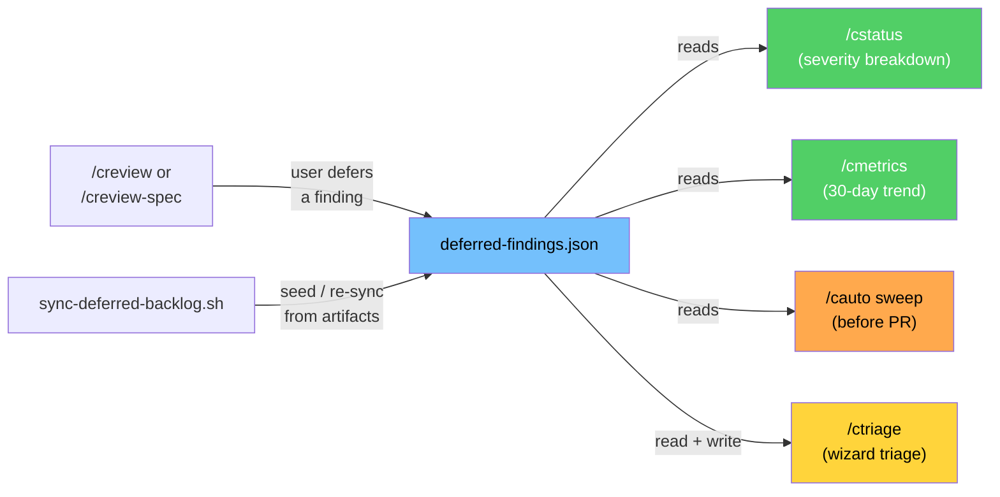

# Deferred Findings Backlog

> Centralized visibility for non-blocking review findings that were deferred. Spec: `.correctless/specs/deferred-findings-backlog.md`. Architecture: ABS-033.

## What It Does

Review skills (`/creview-spec`, `/creview`) identify non-blocking findings and present disposition options. When the user selects "defer," the finding was previously marked in the review artifact but never resurfaced. Over 22 features, 47 non-blocking findings accumulated with status "pending" — invisible to `/cstatus`, `/cmetrics`, and the pipeline.

This feature introduces:

1. **Centralized backlog** at `.correctless/meta/deferred-findings.json` — a JSON file tracking all deferred findings with schema version, auto-assigned `DF-{NNN}` IDs, severity (MEDIUM/LOW/ADVISORY only — HIGH/CRITICAL must be fixed during review per PRH-003), and status tracking (open/in-progress/resolved/wont-fix).
2. **Review skill integration** — `/creview-spec` and `/creview` write deferred findings to the backlog on "defer" disposition, with the sync script as a structural backstop for prompt-level write drift.
3. **`/ctriage` skill** — wizard-style bulk triage (one finding at a time with progress counter), four disposition options per finding (fix now, keep open, won't fix, re-prioritize), incremental saves after each decision.
4. **`/cauto` backlog sweep** — surfaces all open findings between `/cdocs` and consolidation (advisory, never blocking).
5. **`/cstatus` visibility** — severity breakdown, 20-item threshold warning, drift detection suggesting `scripts/sync-deferred-backlog.sh` when review artifacts contain pending findings not in the backlog.
6. **`/cmetrics` trend** — total open, severity breakdown, oldest open finding, 30-day added/resolved counts.

## How It Works



### Backlog File Schema

```json
{
  "findings": [
    {
      "id": "DF-001",
      "source_file": ".correctless/artifacts/review-spec-findings-my-feature.md",
      "finding_id": "RS-004",
      "feature": "my-feature",
      "severity": "MEDIUM",
      "description": "No rate limiting on the retry endpoint",
      "category": "security",
      "status": "open",
      "deferred_at": "2026-05-15T14:30:00Z",
      "resolved_at": null,
      "resolution": null
    }
  ],
  "schema_version": 1
}
```

### Sync Script

`scripts/sync-deferred-backlog.sh` serves dual purpose:

- **Initial seed**: imports all existing pending findings from review artifacts into the backlog
- **Ongoing re-sync**: structural backstop for prompt-level write drift (the review artifact is always the source of truth per AP-029)

The script is idempotent — deduplicates by `source_file` + `finding_id` pair. Severity mapping: BLOCKING/HIGH are skipped (must be fixed in review), NON-BLOCKING maps to MEDIUM, LOW to LOW, INFORMATIONAL to ADVISORY. Also supports `--validate` mode for CI schema checking.

### Design Decisions

- **Local-only**: the backlog lives under `.correctless/meta/` which is gitignored. The sync script can reconstruct it from committed review artifacts on any machine. Team-shared state is a v2 concern.
- **Advisory only**: PRH-001 prohibits gate enforcement — the backlog never blocks pipeline transitions. This avoids the AP-023 "override as routine" problem.
- **Multi-writer**: ABS-033 declares this as a multi-writer advisory file (review skills + ctriage + sync script). Unlike ABS-029 (sole-writer for audit artifacts), the backlog is not safety-critical and last-write-wins is acceptable.
- **Won't-fix items persist**: resolution rationale is the audit trail. Items are never deleted from the file.

## See Also

- Spec: `.correctless/specs/deferred-findings-backlog.md`
- Architecture entry: `.correctless/ARCHITECTURE.md` ABS-033
- Sync script: `scripts/sync-deferred-backlog.sh`
- Skill: `skills/ctriage/SKILL.md`
- Tests: `tests/test-deferred-findings-backlog.sh` (65 tests, all passing)
- Consumers: `skills/cstatus/SKILL.md`, `skills/cmetrics/SKILL.md`, `skills/cauto/SKILL.md`
- Writers: `skills/creview-spec/SKILL.md`, `skills/creview/SKILL.md`, `skills/ctriage/SKILL.md`
