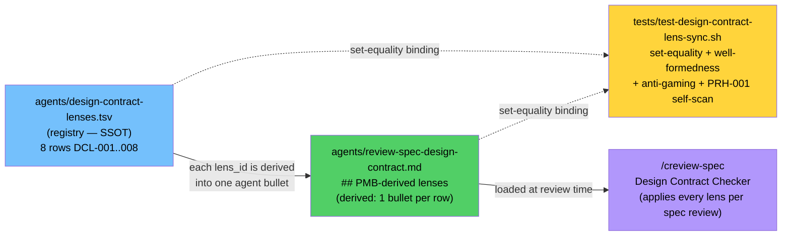

# Design Contract Checker Lens Registry

> Wires the eight documented `/creview-spec` Design Contract Checker lenses into a structural registry so a documented lens can no longer exist only as `CLAUDE.md` prose. Spec: `.correctless/specs/design-contract-lens-sync.md`. Architecture: ABS-050. Closes the DA-001 gap (an AP-036 instance applied to the contract mechanism itself).

## What It Does

Over PMB-013 → PMB-020 the project documented **eight** new Design Contract Checker lenses (cardinality, tool-surface, content-fidelity, extraction-rejection, authoring-affordance, gate-scope, unbounded-input-bounded-medium, mechanism-capability-mismatch), each recorded in `CLAUDE.md` as a "Design Contract Checker addition." But the enforcing agent — `agents/review-spec-design-contract.md` — carried one generic lens and referenced none of them, and neither the agent nor the `/creview-spec` preamble ever loads `CLAUDE.md`. **The documented lenses never reached the reviewer that is supposed to apply them.** That is PMB-016 (corrective-action described-but-not-implemented, AP-036) reproduced by the contract mechanism against itself, surfaced as DA-001 in the 2026-07-10 devil's-advocate report.

The confirming detail: the original spec draft seeded only *seven* lenses and dropped PMB-017's `authoring-affordance` — the exact documented-but-unwired gap this feature exists to close, reproduced in the seed. The seed was re-derived to eight by enumerating every "Design Contract Checker" addition in `CLAUDE.md` rather than trusting a hand count.

This feature makes the lens set a first-class, structurally-enforced artifact:

- a registry TSV is the single source of truth for the lens set,
- the agent must reference every registry lens (and only registry lenses),
- a structural test binds the two by **set-equality** so a documented lens can never again exist only as prose.

## How It Works

- **Registry = SSOT.** `agents/design-contract-lenses.tsv` is a 4-column TSV (`lens_id`, `keyword`, `source_pmb`, `summary`) seeded with the eight lenses (DCL-001 cardinality/PMB-013 … DCL-008 mechanism-capability-mismatch/PMB-020). It is the *only* machine-read source of the lens set.
- **Agent bullets are derived.** The consumer agent carries a `## PMB-derived lenses` section with one bullet per registry row, each tagged with its `DCL-NNN` id, the registry `keyword` verbatim, a directive term (`BLOCKING`/`flag`), and a concrete `when`/`if` condition. The pre-existing generic lens (ABS/PAT composition, `Enforcement:`-field check, TB cross-reference) is retained alongside.
- **Set-equality test.** `tests/test-design-contract-lens-sync.sh` binds registry ↔ agent both ways: every registry `lens_id` is referenced in the agent (completeness — INV-001) and every `DCL-NNN` in the agent maps to a registry row (no-orphans — INV-002). Two extractors share one pinned token regex (`DCL-[0-9]{3}`) but differ in scope — a full-file scan catches out-of-section orphans, a section-scoped scan drives the per-lens bullet checks. A `>= 8` non-empty floor on both sets before comparison closes the vacuous-pass trap (two empty sets are trivially "equal").
- **Anti-gaming, not just presence.** Each agent bullet must carry its keyword verbatim + a directive term (excluding the keyword span) + a `when`/`if` condition token + a `>= 24`-char post-strip body, so a bare stub like `- DCL-003 content-fidelity: flag` fails. The substance loop iterates the **live registry**, not a hard-coded seed, so a future DCL-009 row is covered automatically.
- **cpostmortem Step-3 convention.** `skills/cpostmortem/SKILL.md` Step 3 ("Determine Corrective Action") now instructs: a PMB documenting a new Design Contract Checker lens must add a registry row + a matching agent bullet. This is the author-facing leg (the CLAUDE.md → registry link), deliberately a prompt-level convention, never a prose-scan (see Limitations).

## Adding a New Lens (Runbook)

1. **Allocate the id** as `DCL-<max+1>` where `max` is the highest existing numeric `lens_id` in the registry. The id number is **independent of the source PMB number** — the seed intentionally decouples them (e.g. DCL-006 ↔ PMB-018), so do not assume DCL tracks PMB.
2. **Add one registry row** to `agents/design-contract-lenses.tsv`: `DCL-<next><TAB>keyword<TAB>PMB-xxx<TAB>summary`.
3. **Add one bullet** in the agent's `## PMB-derived lenses` section carrying the same id, its keyword verbatim, a directive term (`BLOCKING`/`flag`), and a concrete `when`/`if` condition (≥ 24 chars of body after stripping the id/keyword/directive).
4. **Run the test**: `bash tests/test-design-contract-lens-sync.sh` (set-equality + well-formedness + anti-gaming all green).

Retiring a seed lens is not just deleting its row and bullet — the eight seed rows are frozen by INV-004, so you must also edit INV-004's seed list in the test, or the suite fails closed.

## Known Limitations / Residuals

Named honestly per AP-040 / PMB-020 — each residual is smaller than the cure and left to PR review:

- **R-A (semantic correctness not structurally verified).** INV-005 binds id + keyword + directive + condition + body-floor, but **cannot verify the lens body is semantically correct** — an author who writes a plausible-but-wrong condition (e.g. pairing `content-fidelity` with a cardinality check) passes. Structural tests prove wiring, keyword-binding, and the presence of a trigger — not correctness. Backstop: PR review + the mini-audit `lens-body-anti-gaming` lens.
- **CLAUDE.md → registry is a prompt-level convention, not a gate (OQ-001).** registry ↔ agent is structurally enforced; CLAUDE.md → registry is not. A future PMB could document a lens and add it to *neither*, uncaught. Closing that structurally would require prose-scanning `CLAUDE.md` (PRH-001), which recreates the origin class (AP-031/AP-036). Accepted: the residual is smaller than the disease, and the `/cpostmortem` Step-3 convention (INV-006) is the mitigation. This residual has a **confirmed prior instance** (the dropped 7-seed), so it is demonstrated, not theoretical.
- **Migration seam.** A `## PMB-derived lenses` bullet with no DCL token passes the sync test vacuously (the extractor only counts DCL tokens). Reviewers must reject any old-style prose lens bullet that lacks a DCL id — documented as a reviewer-reject note in the agent.
- **Bogus PMB reference (R-C).** The registry accepts any `PMB-[0-9]{3}` in `source_pmb`; it does not verify the PMB exists or is relevant (verifying would require scanning CLAUDE.md, PRH-001). A PR-review catch.
- **Source-only / user installs (R-D).** The registry is source-only: `sync.sh` mirrors only `agents/*.md`, so the `.tsv` never ships. User projects receive the lens bodies inline in the shipped agent `.md`; only the correctless self-test reads the registry. registry ↔ agent drift is caught only by correctless-repo CI (at release time, so users receive a validated agent body). The shipped `/cpostmortem` Step-3 instruction names the source-only registry path, which is inert (not error-producing) on user installs.

See ABS-050 in `.correctless/ARCHITECTURE.md` (index) and `docs/architecture/abstractions.md` (full body) rather than duplicating the invariant list here.
