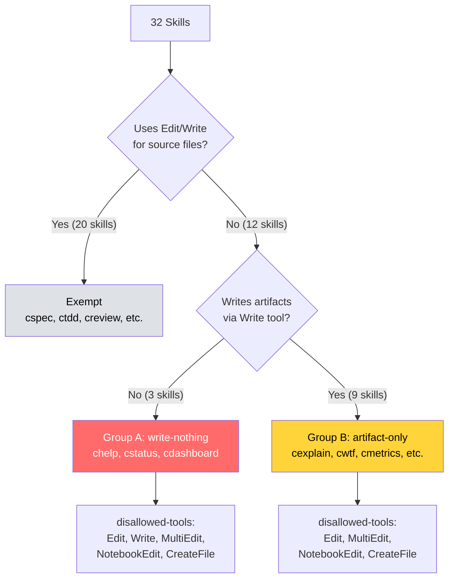

# Disallowed-Tools Frontmatter

> Defense-in-depth tool removal for read-only and artifact-only skills. Spec: `.correctless/specs/disallowed-tools.md`. Architecture: PAT-018 (application), ENV-011.

## What It Does

Claude Code v2.1.150 introduced `disallowed-tools` in skill YAML frontmatter, which structurally removes listed tools from the model while the skill is active. This feature applies `disallowed-tools` to 12 skills that should never edit source files, providing a second enforcement layer alongside the existing `allowed-tools` whitelist.

The existing `allowed-tools` already excludes these tools via whitelist (tools not listed are unavailable). `disallowed-tools` adds an explicit blocklist that documents write-prohibition intent directly in the frontmatter and provides harness-enforced tool removal as defense-in-depth (PAT-018).

## Skill Classification



### Group A (write-nothing)

Skills that produce no file output at all. All five write-capable tools are disallowed.

| Skill | Purpose |
|-------|---------|
| `/chelp` | Quick reference display |
| `/cstatus` | Workflow state display |
| `/cdashboard` | HTML dashboard generation (writes via Bash, not Write tool) |

### Group B (artifact-only)

Skills that write artifacts (e.g., `.correctless/artifacts/wtf-*`) via the `Write` tool but should never edit source files. Four tools are disallowed; `Write` is retained for artifact output.

| Skill | Purpose |
|-------|---------|
| `/cexplain` | Guided codebase exploration |
| `/cwtf` | Workflow audit |
| `/cmetrics` | Project health metrics |
| `/csummary` | Feature summary |
| `/cpr-review` | Incoming PR review |
| `/cmaintain` | Contribution review |
| `/cmodel` | Alloy formal modeling |
| `/cmodelupgrade` | Model upgrade regression report |
| `/ctriage` | Deferred findings triage |

## How It Works

The `disallowed-tools` line sits in the YAML frontmatter alongside `allowed-tools`:

```yaml
---
name: cwtf
description: Audit the workflow itself...
allowed-tools: Read, Grep, Glob, Write(.correctless/artifacts/wtf-*), Bash(git*), Bash(jq*), Bash(find*), Bash(grep*)
disallowed-tools: Edit, MultiEdit, NotebookEdit, CreateFile
---
```

When Claude Code loads this skill, it removes `Edit`, `MultiEdit`, `NotebookEdit`, and `CreateFile` from the model's available tools. The model cannot invoke these tools even if instructed to — the harness rejects the call before the model sees the result.

On Claude Code versions older than v2.1.150, the `disallowed-tools` key is silently ignored. The `allowed-tools` whitelist remains the sole enforcement layer. No crash, no error, no degradation.

## Structural Enforcement

### R-005: Disjointness

The sets of tools in `disallowed-tools` and `allowed-tools` must be disjoint for each skill. A tool that appears in both lists would create a contradictory configuration. The test extracts tool basenames by stripping sub-pattern scoping (e.g., `Write(.correctless/artifacts/wtf-*)` yields `Write`) before checking disjointness.

A specific sub-rule enforces that Group B skills do NOT disallow `Write` — they need it for artifact output.

### R-007: Drift Test

A structural drift test enumerates all 32 skills and partitions them into Group A, Group B, or Exempt. Every skill must be classified. An unclassified skill is a test failure, ensuring that any new skill added to the project is immediately caught and classified.

## Testing

117 tests in `tests/test-disallowed-tools.sh` covering all 7 spec rules:

- **R-001/R-002**: Exact frontmatter value for all 12 skills
- **R-003**: Frontmatter placement (between `---` delimiters, not in body)
- **R-004**: Distribution copy parity (source vs `correctless/skills/`)
- **R-005**: Disjointness with `allowed-tools` + Group B Write prohibition
- **R-006**: AGENT_CONTEXT.md documentation presence
- **R-007**: Full skill partition (Group A + Group B + Exempt = all skills)

## Known Limitations

- **Runtime enforcement is Claude Code's responsibility.** Tests verify frontmatter presence and correctness, not that Claude Code actually removes the tools at runtime. If Claude Code has a bug in `disallowed-tools` processing, the `allowed-tools` whitelist is the fallback.
- **Version dependency.** Requires Claude Code v2.1.150+ for enforcement. See ENV-011 in `.correctless/ARCHITECTURE.md`.
