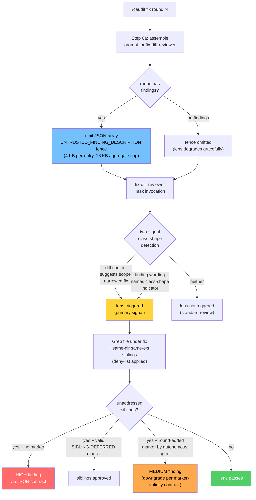
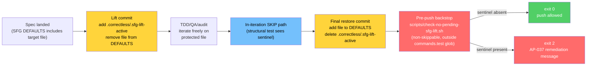

# Fix-Diff Reviewer Class-Shaped Bug Lens

> Adds a class-shaped bug detection lens to `agents/fix-diff-reviewer.md` and the lift-and-restore workflow contract for SFG-protected deliverables. Spec: `.correctless/specs/fix-diff-reviewer-class.md`. Architecture: ABS-041 (SFG lift-and-restore contract); AP-039 layer-4 LANDED tag. Motivated by PMB-019 (ARG_MAX recurrence in `scripts/build-dashboard.sh` one month after PR #124's scope-narrowed fix).

## What It Does

When `/caudit` invokes the fix-diff-reviewer after each round, the reviewer now grepps for sibling instances of class-shaped bugs in the file under fix and same-directory same-extension sibling modules before approving the fix. PR #124 (2026-05-14) fixed an ARG_MAX overflow in `scripts/build-dashboard.sh` at the outer `collect_artifacts -> BROWSER_SPECS` boundary and never checked the inner `read_file_json` helper using the same `--arg content "$content"` pattern. One month later, PMB-019 documented the recurrence in the same script. PR #124's reviewer had no prompt direction to grep for siblings; the lens closes that gap.

The lens activates on two signals:

- **Primary — diff content.** The reviewer inspects diff text and surrounding hunk context for patterns that suggest a scope-narrowed instance fix (substitution of pattern X with pattern Y at one site, single-occurrence error-handling additions, loop-variable scope fixes, single-site lock/unlock pairs).
- **Refinement — finding description.** When the `<UNTRUSTED_FINDING_DESCRIPTION>` fence is present (emitted by `/caudit` Step 6a in JSON-array form per the per-round prompt-assembly block), each finding's wording is examined for class-shape indicators ("overflows", "fails at scale", "silently truncates", "exhausts", "rate-limited", "deadlock", "race"). Either signal alone can trigger the lens; both together raise confidence.

When triggered, the reviewer's pinned tool surface (`Read`, `Grep`, `Glob`) is exactly the surface needed. Unaddressed siblings emit a `HIGH` finding through the existing JSON output contract — unless a `SIBLING-DEFERRED:` marker covers them with substantive rationale per the marker-validity contract (round-added markers downgrade to `MEDIUM` to close the self-excusing risk).

The sibling-grep scope is bounded to same-directory same-extension modules with an explicit deny-list (`.env*`, `.correctless/preferences*`, `.correctless/artifacts/autonomous-decisions-*`, `.git/objects/**`). This is a narrow scope amendment to the existing "Out of scope: the unchanged codebase" line in the agent's prose, not a broad re-scope.

## How It Works

### Two-Signal Detection in the Agent Prose

The lens body in `agents/fix-diff-reviewer.md` (Class-shaped bug detection section) names a non-exhaustive seed list of *code patterns* (not bug-description keywords) — `--arg "$var"` substituted with `--rawfile`/`--slurpfile`, `2>/dev/null` additions at one error site, single-site `lock`/`unlock` pairs. The seed list is explicitly marked non-exhaustive to avoid the AP-024 hardcoded-list class-incomplete failure mode. The reviewer applies semantic judgment beyond the seed.

When the `<UNTRUSTED_FINDING_DESCRIPTION>` fence is absent (no findings in the round, or fence omitted per RS-006), the lens degrades gracefully — diff content alone is enough to trigger. The reviewer never assumes the refinement signal must be present.

### Marker-Validity Contract

The `SIBLING-DEFERRED:` carve-out is honored ONLY when:

1. The marker appears as a syntactic comment in the diff fence (`#`, `//`, `--`, `/* */`, `<!-- -->`, `;`) — never as text inside `<UNTRUSTED_FINDING_DESCRIPTION>` (closes the self-referential trust loop without requiring TB-005 extension). Python triple-quoted strings (`"""..."""`) are NOT a comment style — they're string literals; markers inside them are rejected.
2. The rationale prose is substantive (30-character floor, non-template) — three explicit reject-as-non-substantive examples are in the agent prose.
3. The marker is human-attributable. Markers added in the same commit as the scope-narrowed fix by an autonomous agent DO NOT fully suppress the finding — they downgrade severity to `MEDIUM` with the finding still emitted naming the unaddressed siblings (closes the self-excusing risk without requiring human-signing infrastructure).

### Per-Round Fence Emission

The fence is emitted as a JSON array (`[{"id": "...", "description": "..."}, ...]`) covering all in-round findings. Empty/whitespace-only descriptions are omitted from the array. When the array would be empty, the entire fence is omitted (no empty fence emission). Per-description size cap is 4 KB after which truncation appends `[truncated: N more bytes]`; the aggregate fence is capped at 16 KB with proportional truncation if needed.

## The SFG Lift-and-Restore Workflow Contract

This is the 3rd consecutive PR where the protected asset is the deliverable (AP-037): PR #150 (ctdd-red.md, 2 collisions), PR #158 (prune-scan.sh, 4 collisions), and this PR (fix-diff-reviewer.md, 1 lift + 1 restore). It also is the first PR to land the **prevention infrastructure** alongside the collision, codified as ABS-041:

Three artifacts make the contract:

1. **Sentinel file** at `.correctless/.sfg-lift-active` — single line `lift-active: <feature-name>`, ≤80 chars. Committed at the repo-tracked root of `.correctless/` (NOT under gitignored subdirs). Added in the lift commit, removed in the restore commit; both are real tree changes — the sentinel cannot be local-only and silently bypass the gate.
2. **In-iteration SKIP path** in `tests/test-fix-diff-reviewer-agent.sh` (and any structural test that asserts the protected file is in DEFAULTS) — when the sentinel exists, the lift-state assertion SKIPs with a remediation message naming AP-037 and the lift-and-restore procedure. Unblocks iteration during QA/audit fix rounds.
3. **Non-skippable final-state backstop** at `scripts/check-no-pending-sfg-lift.sh` — a dedicated single-purpose script that lives OUTSIDE the `tests/test-*.sh` glob (deliberately not in `commands.test`), exits 0 when the sentinel is absent and exits 2 with a remediation message naming AP-037 when present. Designed-for invocation sites: pre-push, CI workflow, `/cauto` Step 8 consolidation, or `commands.pre_push` when populated.

The backstop's placement outside `commands.test` is deliberate. Putting it inside the test glob would reintroduce the original contradiction — iteration would block on the same gate it needs to bypass for the QA/audit loop to run. The non-skippable backstop runs at the *pre-deliver* boundary instead.

### Known Adoption Gaps (Honest Disclosure)

The contract documents two invocation sites that are not yet wired by their consumers:

- `.claude/rules/sfg-deliverable.md` — referenced by ABS-041 as the path-scoped rule that loads when an agent opens `hooks/sensitive-file-guard.sh` or a DEFAULTS-listed file. The rule file does not exist yet; addition is deferred to a follow-up PR.
- `/cauto` Step 8 backstop invocation — `skills/cauto/SKILL.md` Step 8 (consolidation) does not yet invoke `scripts/check-no-pending-sfg-lift.sh`. Operators currently invoke it manually (or via a pre-push hook they configure). Wiring is deferred to the `/cauto` Step 8 amendment in `commands.pre_push` work.

## Why It Matters

The lens is preventive structure for the *class* of "same script, same shape, fixed at the wrong scope" failures. PMB-019 named the class shape: when a fix lands for a class-shaped failure ("overflow", "scale", "truncation", "exhaustion"), the corrective action must be class-widened to the bug pattern, not scope-narrowed to the failing call site. The fix-diff reviewer is the natural enforcement point because it runs against every fix round before the next round begins — earlier than CI, earlier than the next /caudit cycle, earlier than the PR review.

The SFG lift-and-restore contract is the operational complement. AP-037's per-PR tax — ~5-10 min × iteration count — was a blocker-class friction that grew monotonically as more sole-writer features added paths to DEFAULTS. ABS-041 operationalizes the lift-and-restore workflow that PR #150 and PR #158 discovered ad hoc, so the next protected-asset-as-deliverable PR can adopt the pattern without rediscovery cost.

## What's Out of Scope

- A scanner rule that detects the specific `--arg "$cat-of-file"` pattern at static-analysis time — that is issue #175 part 2, a separate deliverable (AP-039 layer-1 mechanical antipattern check).
- Migration of the existing 5 "What to check" items into per-lens sections — documentation restructure with no behavioral change.
- Sourcing the keyword list from a config file — deferred per OQ-001.
- A telemetry counter that validates the lens fires in practice — deferred per OQ-002.
- A config kill switch for the lens — deferred per DF-027.
- Extending TB-005 in ARCHITECTURE.md to model the self-referential trust loop — closed via the marker-validity contract; the architectural amendment is deferred.

## Implementation Pointers

- Lens prose: `agents/fix-diff-reviewer.md` Class-shaped bug detection section (lines 72-280 approx); byte-equal mirror at `correctless/agents/fix-diff-reviewer.md` per ABS-010
- Step 6a fence emission: `skills/caudit/SKILL.md` per-round prompt-assembly block (between Step 6a internal Step 3 and Step 5); byte-equal mirror at `correctless/skills/caudit/SKILL.md`
- Final-state backstop: `scripts/check-no-pending-sfg-lift.sh` (40 LOC, outside `tests/test-*.sh` glob)
- Prompt-composition helper: `tests/helpers/build-caudit-prompt.sh` (~85 LOC, static-text concatenator)
- Real-fixture provenance: `tests/fixtures/fix-diff-class-shaped-{argmax,loop-var,error-handling}.diff` (argmax fixture derived from PR #124 / PMB-019 commit per AP-031 prevention)
- Structural test: `check_class_shaped_bug_detection` in `tests/test-fix-diff-reviewer-agent.sh:2276` — 16 sub-assertions + cardinality checklist

## Related

- Postmortem: PMB-019 (`scripts/build-dashboard.sh` ARG_MAX recurrence, one month after PR #124's scope-narrowed fix)
- Antipattern: AP-039 layer 4 (the lens IS the fix-diff reviewer prompt update named in AP-039's how-to-catch-it section)
- Antipattern: AP-037 (protected asset is the deliverable — third confirmed instance with prevention infrastructure landing)
- Architecture: ABS-041 (SFG lift-and-restore sentinel + final-state backstop contract)
- Architecture: ABS-010 (plugin-agent file contract — distribution mirror byte-equality)
- Architecture: TB-005 (untrusted-data fences — `<UNTRUSTED_FINDING_DESCRIPTION>` joins the family)
