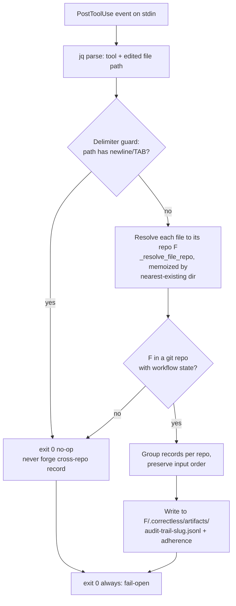

# Audit-Trail File-Repo Attribution (#244)

> `hooks/audit-trail.sh` attributes each recorded event to the **edited file's own git repo**, not the shell's cwd. Spec: `.correctless/specs/hook-repo-root-for.md`. Architecture: ABS-046 (record contract, unchanged), PAT-005 (fail-open PostToolUse), ABS-001 (lib.sh single-definition — with a documented local-resolver deferral).

## What It Does

`hooks/audit-trail.sh` is a PostToolUse hook that records every file modification into a per-workflow JSONL trail (and, in full mode, an adherence-state file). It used to derive **everything** — the artifacts-dir fast-path, the branch slug, the state file, the trail file, the config, and the `branch` field written into every record — from the hook's **cwd**, not from the edited file's repo.

When the harness edited a file in a sibling git repo/worktree while cwd was a *different* repo, the event was either logged under the **wrong** repo's trail or (if cwd had no `.correctless/artifacts` dir) **dropped entirely**. This is the silent-telemetry-failure class: `/cmetrics`, adherence coverage, and history silently attributed work to the wrong repo while the substrate looked healthy.

The hook now attributes each event to the **edited file's own repo F**:

- Resolve F from the file path with a small resolver **local to the hook** (`_resolve_file_repo`): walk up from the path's nearest existing ancestor directory and run `git --no-optional-locks -C <dir> rev-parse --show-toplevel`.
- Derive the slug / state file / trail / config / record `branch` / adherence file all from F.
- If the file is in **no git repo**, or F has **no active workflow state**, the hook **no-ops** (exit 0) — it never misattributes to cwd.

## How It Works

- **Memoization** is keyed by the file's **nearest-existing directory** (not a prefix cache), so cost is `O(unique dirs)` and **nested repos/submodules resolve to the innermost repo** (per-directory `git` authority) rather than being misattributed to a parent.
- **Empty branch** (detached HEAD / non-repo) → no-op. The empty value is never passed bare into `branch_slug()`, which would otherwise fall back to the cwd branch and re-introduce the leak.
- **Delimiter guard**: the multi-file fan-out multiplexes paths through newline/TAB separators; a resolved path or repo root containing either is skipped (fail-open no-op) so a crafted path can't forge a phantom record into a second repo's trail.

## Behavior Notes / Known Limitations

- **Single-repo projects are unaffected.** When cwd is the edited file's repo (the overwhelmingly common case), the resolved trail/state/config point at the **same target files** (same inode) as before. A bonus: launching `claude` from a *subdirectory* of your repo now logs correctly, where the old cwd-relative fast-path silently logged nothing.
- **Cross-repo attribution discontinuity.** After upgrade, edits to a sibling repo's files move from the cwd repo's trail into the correct repo's trail. Historical misattributed records are **not** repaired (non-goal). Cross-repo `/cmetrics` may show a one-time discontinuity.
- **Nested-repo edits** during a *parent* workflow record under the **nested** repo, so `/cwtf`'s parent-workflow deviation/coverage lenses do not see them. Intended (avoids misattributing submodule files to the parent). Zero impact for projects without submodules.
- **`token-tracking.sh` remains cwd/session-scoped by design.** Token/cost is a session concept and is not attributable to an individual edited file's repo, so the two PostToolUse hooks intentionally do **not** share an attribution model.
- **Out-of-tree edits** (files in no git repo — e.g. `~/.claude/…`, `/tmp` scratch) no longer count toward adherence coverage.
- **Fail-open telemetry, not a security boundary.** No `safe.directory`/`GIT_CEILING`/`timeout` hardening was added (PMB-020/AP-040: this hook is a cooperative-loop guardrail). Any resolution miss, missing `git`, or malformed input degrades to a clean `exit 0`.

## Scope

Narrowed from the original #244, which named three instances of the cwd-vs-artifact bug. **workflow-gate** was already fixed by #242/PR #243; **sensitive-file-guard**'s `custom_patterns`-from-cwd residual is mild (DEFAULTS intact) and left as-is. This feature fixes the one genuine correctness instance — **audit-trail** — and keeps the resolver local to the hook (not `lib.sh`) to avoid the AP-037 self-guard (a documented ABS-001 deferral; follow-up: extract a shared `try_repo_root_for` into `lib.sh` and dedup with #242's walk).
