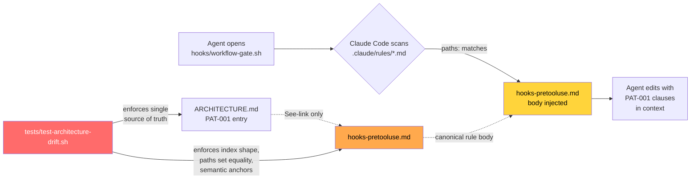

# Path-scoped rules (dogfood prototype)

## What it does

Claude Code loads rule files from `.claude/rules/*.md` into an agent's editing
context whenever a file matching the rule's `paths:` frontmatter is opened for
reading, editing, or writing. This feature migrates `PAT-001: PreToolUse hook
conventions` from `.correctless/ARCHITECTURE.md` into the first such rule file
(`.claude/rules/hooks-pretooluse.md`) as a dogfood prototype for the broader
rules-canonical / ARCHITECTURE-index pattern.

`.correctless/ARCHITECTURE.md` retains a 2-line index entry pointing at the rule
file. A structural drift test (`tests/test-architecture-drift.sh`) enforces that
the rule text lives in exactly one location and that the index line has the
exact required shape.

## Why

The Olympics audit (2026-04-09) found two PAT-001 clause-5 violations in
`hooks/workflow-gate.sh` — fail-open on malformed stdin JSON and silent
degradation from corrupted config. Git archaeology showed the `|| exit 0`
pattern persisted across 7+ hook-touching PRs over ~4 days before any reviewer
caught it. The failure mode is not *introduction* (the pattern was introduced
once and forgotten); the failure mode is *persistence* — the rule sat in
`.correctless/ARCHITECTURE.md` where no agent editing `hooks/workflow-gate.sh`
would see it in context.

Path-scoped rules close that gap: when an agent opens `hooks/workflow-gate.sh`,
Claude Code automatically loads the PAT-001 rule body into context. The rule is
in the agent's face at the moment of editing, not buried in an architecture
document the agent may never read.

## How it works

## Scope

**Migrated**: PAT-001 (PreToolUse hook conventions) only.

**Not migrated**: PAT-002 through PAT-010 remain full-body in
`.correctless/ARCHITECTURE.md`. The convention is on probation — new PAT entries
default to full-body form until the measurement gate passes.

## Measurement gate (post-merge, dormant)

The feature is only considered successful if a post-merge measurement gate
confirms one of two signals:

1. **Prevention signal (MG-001)** — the rule was in the agent's context at the
   time of any future PAT-001 clause-5 violation and failed to prevent it.
   Measurable only after the `InstructionsLoaded` hook ships (FUTURE-001).
2. **Safety-net signal (MG-002)** — no PAT-001 / PAT-005 / PAT-006 violation
   persists across 3 or more hook-touching PRs. The baseline: the QA-R1-005
   violation persisted across 7+ PRs over ~4 days before the Olympics audit
   caught it. A 3-PR persistence ceiling is roughly half the baseline.

`/cstatus` has a dormant check that emits "Measurement overdue" when 3+
hook-touching PRs have landed since the feature merged. At that point a human
runs the measurement procedure (MG-003). On failure, the rollback procedure
(spec PRH-002) restores PAT-001 to its full-body form in ARCHITECTURE.md and
removes the rule file. The drift test infrastructure is left in place for a
future retry.

## Files and responsibilities

| File | Role |
|------|------|
| `.claude/rules/hooks-pretooluse.md` | Canonical rule body: all 5 PAT-001 clauses verbatim, violated-when list, rationale citing QA-R1-004/005 with persistence duration, dogfood marker |
| `.correctless/ARCHITECTURE.md` | Index entry (`### PAT-001:` + See-link). New ABS-009 (contract), ENV-005 (mechanism), ENV-006 (POSIX tools), Patterns reader-note blockquote |
| `tests/test-architecture-drift.sh` | 55 structural checks + 10 negative-case fixtures — enforces shape, content integrity, hook set equality, paths list, in-file rule pointer comments, stale-reference absence, measurement-gate wiring |
| `.correctless/meta/pat001-measurement-due.json` | Dormant measurement trigger with `due_at_pr_count: 3`; `/cstatus` reads it; `/cdocs` back-fills `created_at_commit` at merge time |
| `.correctless/verification/path-scoped-rules-pat001-canary.md` | Pre-GREEN canary evidence proving `.claude/rules/` + `paths:` mechanism works (EA-003/ENV-005) |
| `hooks/workflow-gate.sh`, `hooks/sensitive-file-guard.sh` | In-file rule pointer comment (`# Rule: .claude/rules/hooks-pretooluse.md (PAT-001 — fail-closed posture)`) — belt-and-suspenders for editors that don't load path-scoped rules |

## Authoring a rule file

Only three skills (`/cspec`, `/cdocs`, `/cupdate-arch`) have `Write(.claude/rules/*.md)` in
their `allowed-tools` frontmatter. `tests/test-architecture-drift.sh::check_inv023`
enforces the allowlist as a structural check. If you need another skill to
author rule files, add the permission explicitly and update INV-023.

Every `.claude/rules/*.md` rule file must:

- Start with YAML frontmatter containing a `paths:` key listing the exact files
  it scopes to (exact path matches; glob semantics are not verified by Feature A)
- Include a visible dogfood-vs-user-project marker if it references project-specific
  audit finding IDs (see INV-026)
- Keep LF line endings (enforced via `.gitattributes`)
- Contain a rationale section citing concrete historical failures with dates and
  persistence duration (project convention captured in the user's memory system)

## Spec reference

Full rules, invariants, prohibitions, measurement gate, rollback procedure, and
review findings:

- Spec: `.correctless/specs/path-scoped-rules-pat001.md`
- Canary evidence: `.correctless/verification/path-scoped-rules-pat001-canary.md`
- Verification: `.correctless/verification/path-scoped-rules-pat001-verification.md`
- ARCHITECTURE entry: `.correctless/ARCHITECTURE.md` — ABS-009, ENV-005, ENV-006
