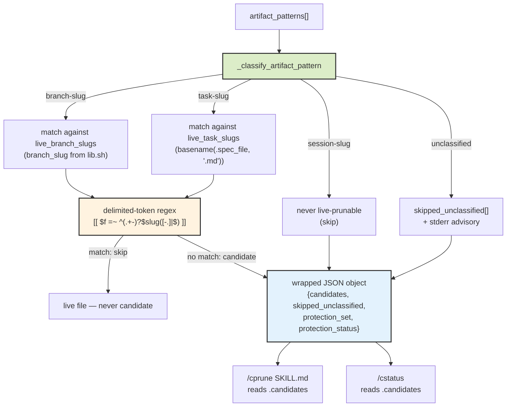

# Slug-Type-Aware Artifact Classification

> Closes the 2nd instance of AP-032 by giving `scripts/prune-scan.sh` an explicit slug-type model. Spec: `.correctless/specs/prune-scan-slug-aware.md`. Architecture: ABS-039, ABS-040, PAT-020. Antipattern: AP-032 (2nd instance).

## What It Does

`scripts/prune-scan.sh` scans `.correctless/artifacts/` for orphaned files left behind by deleted or unknown branches. The pre-feature scanner treated every pattern in `artifact_patterns` as branch-slug-named, but the repo actually uses three different slug conventions: branch-slug (`feature-<name>-<md5[:6]>`), task-slug (bare task slug for `qa-findings-*.json`, `audit-mini-*.json`, etc.), and session-slug (Claude Code session ID, never live-prunable). When a task-slug-named file was matched against the live branch-slug set, the match failed and the live file was flagged as a `low`-risk deletion candidate. Autonomous `/cprune` would then delete it.

This feature gives the scanner an explicit slug-type model: `_classify_artifact_pattern` maps every pattern to exactly one of `branch-slug`, `task-slug`, `session-slug`, or `unclassified`; safety-belt matching consults the live-slug set that matches the classification; substring slug primitives are structurally banned; and the scanner output migrates from a bare JSON array to a wrapped object `{candidates, skipped_unclassified, protection_set, protection_status}` so consumers know which patterns were skipped and what protection set was applied.

## How It Works



The classification function is total over `artifact_patterns` — every pattern must have a mapping or the structural test (INV-001) fails. The pattern-to-slug-type mapping lives in the spec as a producer-pattern table (INV-008), cross-referenced at CI time against both the function's case branches and the `artifact_patterns=` assignment line. Drift in either direction fails the test.

Slug matching uses delimited-token bash `[[` regex with `[-.]` character class for boundaries — it distinguishes `feature-foo-abc` from `feature-foo-def` and `qa-findings-foo` from `qa-findings-foo-2`. Substring primitives (`grep -F "$slug"`, `case "$f" in *"$slug"*)`, unquoted `=~ $slug`) are structurally banned by the `prune-scan-substring-match` rule in `scripts/antipattern-scan.sh check_shell()`. Slug values are also validated by `_slug_is_safe` at extraction boundaries AND ERE metacharacters are escaped by `_escape_ere_metachars` before being interpolated into regex — dual defense ensures malformed slugs are rejected AND that any slug that slips through cannot exploit ERE metachar interpretation.

## Safety-Belt Completion

Six fail-closed paths were added in this feature so the safety belt cannot silently collapse:

1. **Empty live-branch-slug set**: when `git branch` returns no live branches (corrupted repo, fresh clone), the scanner fails non-zero with a stderr advisory instead of proceeding with an empty set — which would otherwise classify every artifact as orphaned.
2. **Empty live-task-slug set**: same fail-closed behavior when `.spec_file` lookups return zero task slugs.
3. **Missing realpath**: `_realpath_tool_available` probes for `realpath`/`readlink -f` at scan entry. Neither available → exit non-zero with stderr advisory. Never silently falls back to lexical `canonicalize_path` for symlink-equivalence decisions (PAT-020).
4. **Workflow-state mid-write TOCTOU**: identity comparison uses content-based `started_at` string equality (primary) → composite `task|branch` (fallback) → `sha256(file)` (last resort). Never mtime — extends the ABS-029 content-based-match convention.
5. **Non-git BASE_DIR**: scanner aborts with stderr advisory rather than proceeding with `git` errors silently swallowed.
6. **lib.sh sourcing failure**: when `branch_slug()` isn't defined after sourcing, scan_artifacts aborts before consuming the missing function.

## Baseline Manifest (ABS-040)

`.correctless/meta/prune-pattern-baseline.json` records the operator-acknowledged pattern set. Schema: `{"patterns": [...], "updated_at": "{ISO}", "schema_version": 1}`.

Sole writer is `scripts/prune-scan.sh --update-baseline`. The scanner never updates the baseline as a side effect of scanning — autonomous `/cprune` runs, `/cstatus` runs, and default-mode `/cprune` runs all leave the baseline untouched. Baseline update happens only when `/cprune` SKILL.md invokes the scanner with `--update-baseline` after interactive human confirmation.

For any pattern present in current `artifact_patterns` but absent from the baseline, candidates emitted via that pattern carry `risk: "medium"` (interactive-only) with reason text `Newly added pattern '{pattern}' — first scan after upgrade; review before deletion`. This prevents auto-promotion of newly-added patterns to `low` risk without human review. The baseline file is SFG-protected.

When the baseline file is missing or corrupt, the scanner fails closed to all-medium (INV-011a) — it does not proceed as if baseline equaled current set.

## Schema Migration

Before this feature, `prune-scan.sh` emitted a bare JSON array of candidates. After this feature, it emits a wrapped object:

```json
{
  "candidates": [...],
  "skipped_unclassified": [
    {"pattern": "prune-test-synthetic-*.json", "reason": "unclassified pattern", "files": [...]}
  ],
  "protection_set": {
    "live_branch_slugs": ["feature-foo-abc123", "..."],
    "live_task_slugs": ["prune-scan-slug-aware-matching", "..."],
    "session_id": "..."
  },
  "protection_status": {
    "branch_slug_set_populated": true,
    "task_slug_set_populated": true,
    "realpath_available": true
  }
}
```

Consumers must read `.candidates` for the candidate list. `/cprune` SKILL.md and `/cstatus` SKILL.md were both migrated in the same PR. Reading the top-level value as an array fails the consumer migration check in `tests/test-prune-scan-slug-aware.sh` BND-001.

## AP-032 Class Status

This is the 2nd confirmed instance of AP-032 (extraction correct, resolution incomplete). The frequency is now 2; the promotion threshold remains 3. A 3rd instance promotes AP-032 to a PAT-xxx structural rule: "any tool that resolves named references (paths, slugs, identifiers) against on-disk artifacts must define explicit resolution semantics, not lift the comparison primitive from convenience."

The first instance (cprune-skill, 2026-05-24) was basename resolution against literal paths; this instance is substring slug matching against delimited tokens. Both have the same shape — the extraction step worked, the resolution step had an incomplete model of what counts as a match.

## Testing

61 tests in `tests/test-prune-scan-slug-aware.sh` cover all 18 invariants, 2 prohibitions, 2 boundary conditions, the extended EA-001 environment assumption, and the new antipattern-scan rule registration. The real-fixture requirement (AP-031) is satisfied by `tests/fixtures/prune-scan/wfstate-real-sample.json` — a verbatim excerpt of a real workflow-state JSON cited via `# Source:` comment.

Several pre-existing test failures in `tests/test-cprune.sh` (INV-013-d, INV-016-a/b) are unrelated — INV-013-d is the AP-033 pipefail+grep SIGPIPE flake (PMB-012) and INV-016-a/b are gaps in cprune-skill's SFG protection that pre-date this branch.

## Known Limitations

- Verification reports under `.correctless/verification/` are also task-slug-named but live under a different directory the scanner does not currently cover. If a future scanner extension covers `.correctless/verification/`, it will need the same slug-type-aware classification.
- The scanner only operates within `.correctless/artifacts/`. Path-traversal cleanup outside that directory is out of scope.
- The risk-tier policy (`/cprune` autonomous-eligibility rules) is unchanged — `low` is still auto-eligible. The fix is to ensure live artifacts never reach `low` risk via better classification, not to change downstream policy.
