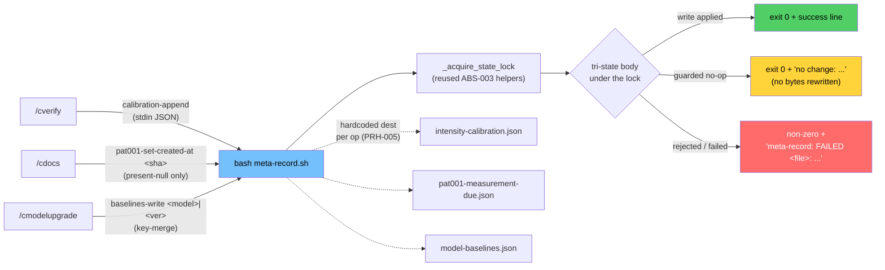

# Sanctioned Sole-Writer for SFG-Protected Meta Artifacts

> One Bash-invoked writer (`scripts/meta-record.sh`) for the three `.correctless/meta/*.json` files whose producer skill was silently blocked by the sensitive-file-guard. Spec: `.correctless/specs/calibration-writer.md`. Architecture: ABS-047 (amends ABS-005, ABS-027). Antipattern closed: AP-037. Resolves #189, #192, #226.

## What It Does

Three SFG-protected meta artifacts had **no sanctioned writer**, so the documented skill that must write them was silently blocked by the sensitive-file-guard's Edit/Write tool-path guard (AP-037 — "the protected asset is the deliverable, the guard has no legitimate-write affordance"):

1. **`intensity-calibration.json`** (#189): `/cverify` is told to append a per-feature calibration row and even held a `Write(...calibration.json)` grant, but SFG blocked the Edit/Write and the append silently no-op'd. The dataset feeding `/cspec` intensity recommendations, `/cmetrics`, and the dashboard was frozen while consumers read stale data and looked healthy (silent-telemetry-failure).
2. **`pat001-measurement-due.json`** (#192/#226): `/cdocs`'s "Back-fill Deferred Meta Fields" step set `created_at_commit` via Edit — also SFG-blocked. Worse, the old back-fill used a `jq '.created_at_commit == null'` test that also matches an **absent** key, and blanket-scanned **all** `.correctless/meta/*.json`, so a run for feature A polluted features B/C baselines with A's merge-base (#226) and added spurious fields to files that never had one (#192).
3. **`model-baselines.json`**: `/cmodelupgrade` held a `Write(model-baselines.json)` grant and wrote it directly — SFG blocked that too. A live, already-broken AP-037 instance of the same shape.

This feature adds a **single general sanctioned sole-writer** invoked via Bash (which SFG does not inspect post-`sfg-edit-write-only`), rewires the three skills onto it, and **closes the AP-037 class structurally** for `.correctless/meta/*.json`: a completeness test asserts every SFG-protected meta json maps to a registered sanctioned writer.

## How It Works

**One writer, three registered operations, each with a hardcoded destination** (PRH-005 — the destination is never derived from input):

- `calibration-append` — append one object to `intensity-calibration.json`'s `calibration_entries[]` from stdin. Deep-equal-preserving over prior entries (INV-001); schema-validated with a **permissive** unknown-field policy so forward-compatible producer growth never causes silent data loss (INV-002).
- `pat001-set-created-at <sha>` — set `created_at_commit` on `pat001-measurement-due.json` **only when the field is present and literally `null`** (`has("created_at_commit") and .created_at_commit == null`). Absent or already-non-null is an intended no-op; any other file is never touched (fixes #192/#226).
- `baselines-write <model>|<version>` — **key-merge** one baseline into `model-baselines.json`, preserving all sibling keys and top-level `schema_version`, failing loud on a schema mismatch rather than clobbering (EXT-002). Never a whole-file overwrite.

**Tri-state exit contract** (the mechanical seam that makes fail-loud provable, not prose):

| Exit | Signal | Meaning |
|------|--------|---------|
| `0` + success line | write applied | the mutation landed and the file is valid JSON afterward |
| `0` + `no change: <reason>` | intended no-op | a guarded outcome — **no file bytes rewritten** |
| non-zero + `meta-record: FAILED <file>: <reason>` | rejected / failed | invalid input, or an attempted write that could not complete |

The `meta-record: FAILED` stdout token is echoed **verbatim** by the calling skill so a failure is surfaced to the user instead of silently swallowed — the fix for the silent-telemetry-failure class at the root of #189.

## Design Notes

- **Reuses locking, hand-rolls only the body** (PRH-006 / DD-008): the writer calls `_acquire_state_lock`/`_release_state_lock` from `lib.sh` (ABS-003) directly. It does **not** call the two-state `locked_update_file` (it cannot express the three-state exit contract and would deadlock if wrapped in a pre-lock). All read, validation, decision, and the atomic `$dest.$$.tmp` + `mv`-after-validate happen inside one critical section.
- **Lock re-gated from `mkdir` to an atomic `ln` create-with-content** (INV-007): mutual exclusion is now gated on hard-linking a pid-bearing sibling temp onto `${dest}.lock/pid` (`ln` fails if the target exists; the pid content is present the instant the file is visible), because `mkdir` was observed non-atomic on the sandbox overlay filesystem. An intermediate `O_EXCL`/noclobber pid create was tried and reverted — it leaves a create→write empty-pid window whose grace-loop reclaim raced under CI's real parallelism (two holders / lost updates). `ln` has no empty window, so no grace loop and no re-verify are needed; only a `kill -0`-dead holder is reclaimed. The pid temp is a sibling of `lock_dir` and `mkdir -p` runs inside the retry loop so a releaser's `rmdir` cannot starve a waiter; release removes the pid token then a best-effort `rmdir` — never a blind `rm -rf`.
- **Bounded, symlink-refusing input** (INV-010): stdin is byte-capped at 64 KB counted with `wc -c` (never `${#var}`), passed via stdin/temp-file never argv (ARG_MAX / AP-039). The destination and its nearest existing parents are checked for symlinks via a **fail-closed** `realpath`/`readlink -f` probe (`_realpath_tool_available`, PAT-020) before any mkdir/temp and re-checked before `mv` — never the lexical `canonicalize_path`.
- **Class closure** (INV-006): `scripts/sanctioned-meta-writers.tsv` (a CI/test-only registry the writer does **not** runtime-read — DD-007) maps every SFG-protected meta json to its `(writer, operation)`. A structural test extracts the DEFAULTS meta set with an anchored `^\.correctless/meta/[^/]+\.json$` regex (rejecting adversarial siblings like `credentials.json`) and asserts every entry has a registry row. All five DEFAULTS meta files are script-backed → zero exemptions → the class is fully closed.

## Honesty Note (Mechanism Capability)

SFG is a **cooperative-loop guardrail, not a security perimeter** (ABS-045, AP-040, PMB-020). It blocks the *naive agent Edit/Write* to a protected path; it does not and cannot inspect or stop a motivated Bash write. "Sole writer" therefore means the **sanctioned/expected write path in the cooperative agent loop** — enforced against agent Edit/Write by SFG and against wrong *content* by the writer's validation plus the append-only / key-merge tests. Out-of-band Bash writes to the meta files or the writer script are an accepted non-goal (AP-040). The symlink/realpath guards are writer robustness inside that boundary, not a perimeter. No invariant claims a strength the cooperative-loop layer cannot deliver.

## AP-037 Recursion

The writer is itself SFG-protected (INV-005) — so `meta-record.sh` is a deliverable that its own guard would block during development. The AP-037 lift-and-restore affordance (`.claude/rules/sfg-deliverable.md`, ABS-041) is the escape hatch: lift the protection with a tracked sentinel while iterating, restore it before push. The feature that closes the AP-037 class for meta artifacts had to use the AP-037 affordance to build its own deliverable.

## Known Limitations

- Retroactive repair of existing #226/#192 pollution is out of scope. `scripts/meta-pollution-detect.sh` (advisory, always exits 0, surfaced in `/cstatus`) *detects and flags* meta files whose `created_at_commit` diverges from their own feature's merge-base; a repair sweep is a follow-up.
- Scope is `.correctless/meta/*.json` only — the class closure does not generalize to non-meta SFG-protected artifacts (scripts, agents, config).
