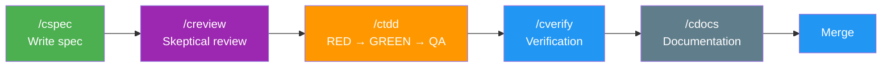

<div markdown="1" style="text-align:center;padding:1rem 0 0.5rem">

# Correctless

Correctness-oriented development workflow for [Claude Code](https://docs.anthropic.com/en/docs/claude-code)
{: style="font-size:1.15rem;opacity:0.85;margin-bottom:0.25rem"}

29 skills · 8 hooks · 3 intensity levels · enforced TDD with agent separation
{: style="font-size:0.9rem;opacity:0.6"}

</div>

---

## The Problem

AI coding agents are fast but unreliable. They skip tests, grade their own work, silently drop edge cases, and ship bugs that pass CI but fail in production. The speed advantage disappears when you spend hours debugging what the agent "completed."

## The Solution

Correctless enforces a structured workflow where **no agent grades its own work**. Separate agents write specs, review specs, write tests, implement code, and audit quality. Hooks gate every file operation — you can't write source code during the test phase, and you can't skip review.



At **high+ intensity**, the pipeline expands with 6-agent adversarial spec review, architecture maintenance, and convergence auditing.

---

<div markdown="1" style="display:grid;grid-template-columns:repeat(2,1fr);gap:1rem;margin:1.5rem 0">

<div markdown="1" style="padding:1.25rem;border:1px solid #30363d;border-radius:8px">

#### Agent Separation

Every phase uses a different agent. The test writer doesn't implement. The implementer doesn't review. The reviewer didn't write the spec.

</div>

<div markdown="1" style="padding:1.25rem;border:1px solid #30363d;border-radius:8px">

#### Phase Gating

Hooks block file operations that violate the current phase. During RED, you can only write tests. During QA, everything is blocked. No shortcuts.

</div>

<div markdown="1" style="padding:1.25rem;border:1px solid #30363d;border-radius:8px">

#### Configurable Intensity

Standard (~15 min/feature) covers core TDD. High adds adversarial review and convergence auditing. Critical adds formal modeling.

</div>

<div markdown="1" style="padding:1.25rem;border:1px solid #30363d;border-radius:8px">

#### Self-Improving

Post-merge bugs feed back as antipatterns. QA findings calibrate intensity. The workflow learns from its mistakes.

</div>

</div>

---

## Quick Start

```bash
# Install the plugin
git clone https://github.com/joshft/correctless.git \
  ~/.claude/plugins/correctless

# In your project directory, run setup
/csetup

# Start building a feature
/cspec "Add user authentication"
```

[Getting Started](getting-started){: .btn .btn-primary .mr-2 }
[View on GitHub](https://github.com/joshft/correctless){: .btn }

---

## Skills at a Glance

| Category | Skills | What they do |
|:---------|:-------|:-------------|
| [Core Workflow](skills/core-workflow) | `/csetup` `/cspec` `/creview` `/ctdd` `/cverify` `/cdocs` `/carchitect` `/cauto` `/crelease` | The spec-to-merge pipeline |
| [Code Quality](skills/code-quality) | `/cquick` `/crefactor` `/cdebug` `/cpr-review` `/cexplain` | Fixes, refactoring, and exploration outside the pipeline |
| [Observability](skills/observability) | `/cstatus` `/chelp` `/csummary` `/cmetrics` `/cwtf` | See what's happening and what the workflow caught |
| [High+ Intensity](skills/high-intensity) | `/cmodel` `/creview-spec` `/caudit` `/cupdate-arch` `/cpostmortem` `/cdevadv` `/credteam` `/cmodelupgrade` | Adversarial review, formal modeling, convergence auditing |
| [Open Source](skills/open-source) | `/ccontribute` `/cmaintain` | Contributing to and maintaining OSS projects |
