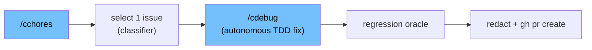

# /cchores -- Autonomous Backlog Grooming

> Pick exactly one suitable open issue from the backlog, fix it with a `/cdebug` TDD cycle, and open a single PR — fully autonomously, inside a hardened envelope. One issue per run. Fail-closed on every ambiguity.

## When to Use

- You have a backlog of small, well-defined bug issues and want an agent to groom them one at a time without supervision.
- Running on a clean feature-branch checkout (never the default branch, never a dirty worktree).
- **Not for:** Large features (use `/cspec` → `/ctdd`), issues that aren't reproducible/diagnosable defects, or anything requiring human judgment on scope. Such issues are classified `unsuitable` and skipped.

## How It Fits in the Workflow

`/cchores` is an autonomous orchestrator that sits alongside the pipeline, not inside it. It composes `/cdebug` (Task-dispatched, fresh context per step) to do the actual root-cause-and-fix work, then handles selection, idempotency, redaction, the regression oracle, and PR creation around it.

## What It Does

### One issue per run

A single `/cchores` invocation selects, fixes, and opens a PR for **exactly one** issue. It never batches. Selection picks the highest-severity *suitable* open issue (or an explicit issue-number override). Severity is judged on issue content, not labels alone (AP-028 calibration triad). Issues that are already in progress, in the cross-run re-selection store, or have an open PR referencing them (exact `Closes/Fixes #N` or a `chore/issue-{N}-*` branch) are skipped.

### Suitability classification

A read-only classifier agent (`agents/cchores-issue-classifier.md`, `tools: Read, Grep, Glob`) labels each candidate `suitable` or `unsuitable`. Issue text is passed inside a nonce fence (the same neutralization used by `/caudit`); instruction-like content in an issue body (e.g. `suitable: true`, `ignore prior analysis`) trips a tripwire that forces `unsuitable`. Ambiguous classification maps to `unsuitable` — fail-closed. The skill consumes the classifier's machine-parseable verdict via `jq -e`; an unparsable verdict aborts.

### Fail-closed behavior

`/cchores` aborts cleanly rather than guessing whenever:

- The worktree is dirty or the checkout is on the default branch.
- The default branch cannot be unambiguously determined (`git symbolic-ref` vs `gh repo view` disagree).
- `commands.test` or `patterns.test_fail_pattern` is unconfigured (caught at **preflight**, before burning a `/cdebug` cycle).
- The redactor (`scripts/redact-secrets.sh`) or its pattern source is missing.
- The classifier agent is unreachable, or its verdict can't be parsed.
- The post-fix diff (`git diff {default}...HEAD`) is empty.
- A real regression survives the oracle, or any pre-PR gate (`shellcheck`, `sync.sh --check`, `check-no-pending-sfg-lift.sh`) fails.

No PR is opened on any abort trigger.

### The regression oracle

After the fix is committed to the chore branch, `/cchores` runs the full configured suite and extracts failing test FILES from runner output using `patterns.test_fail_pattern` plus the configured per-file marker `patterns.test_file_marker`. A failing file is a **real regression** unless it is both (a) outside the touched set *and* (b) passes on re-run (retried up to N=2, 120s per-file timeout). Anything that persists, occurs in a touched file, or whose output can't be parsed (**unknown = real**) blocks the PR. The pre-PR gate is a CI superset.

### The `patterns.test_file_marker` config field (DD-007)

`patterns.test_file_marker` is a config field under `patterns` (default `""`) added to both `templates/workflow-config.json` and `templates/workflow-config-full.json`. It lets the regression oracle identify *which file* a failure belongs to so per-file flake tolerance can apply.

- When set, the oracle extracts the per-file name from runner output and applies flake re-runs per file.
- When **empty** (the default), the algorithm **degrades explicitly** to "any persistent suite failure blocks the PR" — no per-file flake tolerance — and says so in the run report. It does NOT silently hard-fit correctless's `>>> {file}` echo format.

The change is purely additive and namespaced under `patterns`, so `schema_version` is not bumped. `setup` migrates existing installed configs additively (adds the key with `""` if absent, never overwriting a set value). `/csetup` detection MAY populate it when a per-file marker is detectable, but defaults to empty.

### Outbound redaction

Every outbound field — PR title and body, issue comment, commit message, and branch slug — is generated from structured fields and then passed through the coded redactor `scripts/redact-secrets.sh` (each pattern match replaced with `<REDACTED>`). It is the sole redaction entrypoint; redaction is never LLM-performed. If the redactor or its pattern source is absent, `/cchores` fails closed. PR body ≤ 8 KB, comment ≤ 4 KB, with overflow pointing to the local (gitignored) artifact.

## The Autonomous Envelope

`/cchores` runs without human turns, so the safety properties are structural:

- **Shared global working-tree lock** at the fixed path `.correctless/artifacts/worktree.lock`, acquired before any selection or git operation and released on every terminal path. This is the mutual-exclusion point against `/cauto` and any other working-tree-mutating orchestrator.
- **Decision journaling**: each consequential autonomous decision (issue chosen + ranked candidates, suitability verdicts, flake-vs-real calls, abort reason) is appended via `scripts/autonomous-decision-writer.sh` (branch-scoped JSONL). `/cchores` verifies JSONL growth after each `/cdebug` invocation.
- **Run manifest** at `chore-run-{branch_slug}.json` (gitignored, excluded from PR staging) records the selected issue, expected steps, and a terminal status (`complete` / `aborted` / `noop`). `/cstatus` consumes it.
- **Run report** on every terminal state, surfaced in `/cstatus`.
- **Cross-run re-selection store** at `.correctless/meta/cchores-attempted.json` prevents re-selecting the same issue across runs; it is excluded from autonomous GC.

## Configuration

| Field | Default | Purpose |
|-------|---------|---------|
| `commands.test` | (required) | The full suite the regression oracle runs. Empty → preflight abort. |
| `patterns.test_fail_pattern` | (required) | How failing lines are recognized. Empty → preflight abort. |
| `patterns.test_file_marker` | `""` | Per-file marker enabling flake tolerance. Empty → whole-suite blocking. |

## Related

- [`/cdebug`](cdebug.md) — the TDD fix engine `/cchores` Task-dispatches.
- [`/cauto`](cauto.md) — the other autonomous orchestrator that shares the global worktree lock.
- [`/cstatus`](cstatus.md) — surfaces the chore-run manifest and retained branches.
