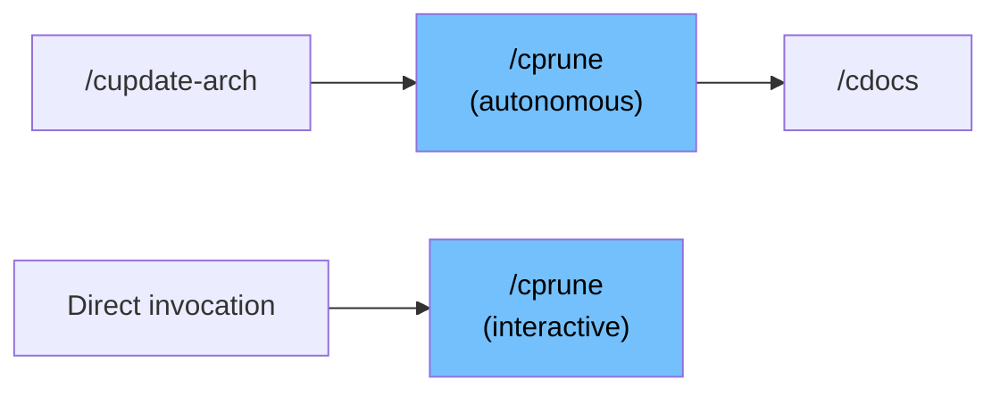

# /cprune -- Documentation and Artifact Pruning

> Detect stale documentation entries and orphaned artifacts, archive what's outdated, clean what's ephemeral. Two modes: autonomous for `/cauto` integration, interactive for direct invocation.

## When to Use

- `/cstatus` surfaces a "pruning recommended" signal (10+ orphaned artifacts or 3+ stale architecture entries).
- After a long series of features, when ARCHITECTURE.md, antipatterns.md, or CLAUDE.md learnings reference files that no longer exist.
- Periodically (monthly) as documentation hygiene.
- **Automatically**: `/cauto` invokes `/cprune` in autonomous mode at the appropriate pipeline step.
- **Not for:** Removing active documentation, triaging deferred findings (use `/ctriage`), or deleting committed source files.

## How It Fits in the Workflow

This skill sits alongside the pipeline rather than in it. `/cauto` invokes it as an internal orchestration action (not a canonical pipeline step) after `/cupdate-arch` at high+ intensity or after `/cverify` at standard intensity. It can also be invoked directly at any time outside an active workflow.



## What It Does

### Scanner

The `scripts/prune-scan.sh` script mechanically detects staleness candidates across 9 categories:

| Category | What It Checks | Risk |
|:---------|:--------------|:-----|
| Architecture entries | ABS/PAT/TB/ENV entries where all referenced file paths are dead | medium |
| Antipatterns | AP-xxx entries where all referenced test files and scripts are dead | medium |
| CLAUDE.md learnings | Learnings with all dead file references (class-level entries excluded) | high |
| Orphaned artifacts | `.correctless/artifacts/` files for branches that no longer exist | low |
| Deferred findings | Open findings whose source review artifact was deleted | medium |
| Count drift | Skill/script/test/agent counts in AGENT_CONTEXT.md vs filesystem | low |
| Cross-references | Stale `Enforced at` and `Violated when` paths in ARCHITECTURE.md | medium |
| Completed specs | Specs for branches merged 30+ days ago | medium |
| Drift debt | Resolved/wont-fix drift-debt entries older than 90 days | low |

The scanner outputs JSON for each category. Each candidate includes: `id`, `category`, `reason`, `risk`, `dead_refs`, `live_refs`, and `bulk_warning`.

### Two Modes

**Autonomous mode** (invoked by `/cauto`): auto-executes low-risk actions only -- orphaned artifact cleanup, AGENT_CONTEXT.md count corrections, resolved drift-debt removal (90+ days), spec archiving (90+ days post-merge). Skips categories where >50% of entries are flagged (BND-002 safety valve). CLAUDE.md is entirely excluded (PRH-002). Returns a summary of actions taken.

**Interactive mode** (direct invocation): presents all candidates in a formatted report. For each category, offers disposition options:
1. Execute all (recommended for low-risk)
2. Review individually
3. Skip this category

### Archive, Never Delete

Documentation entries are moved to archive files, never deleted:
- Architecture entries (ABS/PAT/TB/ENV) go to `.correctless/ARCHITECTURE_DEPRECATED.md`
- Antipatterns (AP-xxx) go to `.correctless/antipatterns-archived.md`
- CLAUDE.md learnings go to `.correctless/CLAUDE_LEARNINGS_ARCHIVED.md`

Archived entries retain their original IDs -- an archived ABS-017 is retired, not recycled. The archive write always completes before the source removal; a crash never results in entry loss.

## What It Reads / Writes

| Reads | Writes |
|:------|:-------|
| `.correctless/ARCHITECTURE.md` | `.correctless/ARCHITECTURE_DEPRECATED.md` |
| `.correctless/antipatterns.md` | `.correctless/antipatterns-archived.md` |
| `CLAUDE.md` (interactive only) | `.correctless/CLAUDE_LEARNINGS_ARCHIVED.md` |
| `.correctless/AGENT_CONTEXT.md` | `.correctless/AGENT_CONTEXT.md` (count fixes) |
| `.correctless/meta/drift-debt.json` | `.correctless/meta/drift-debt.json` (entry removal) |
| `.correctless/meta/deferred-findings.json` | `.correctless/artifacts/prune-report-{date}.md` |
| `.correctless/artifacts/` (scan) | `.correctless/specs/archived/` (spec archiving) |

Note: `/cprune` is read-only for deferred findings (PRH-004). It reports stale findings but does not modify their status -- use `/ctriage` for that.

## Example

```
User: /cprune

Scanning architecture... found 2 candidates.
Scanning antipatterns... found 1 candidate.
Scanning artifacts... found 14 candidates.
Scanning counts... found 0 candidates.
...

--- Architecture Entries (2 candidates) ---

ABS-017: Removed lint config contract
  Risk: medium
  Reason: All 3 referenced files deleted (scripts/lint-check.sh,
          hooks/lint-gate.sh, tests/test-lint.sh)
  Archive to: .correctless/ARCHITECTURE_DEPRECATED.md

ABS-022: Legacy auth middleware contract
  Risk: medium
  Reason: All referenced files deleted after auth refactor

Options:
  1. Execute all (archive both)
  2. Review individually
  3. Skip this category

User: 1

Archived ABS-017 and ABS-022 to .correctless/ARCHITECTURE_DEPRECATED.md.
```

## Intensity Levels

Available at all intensity levels. At high+ intensity, `/cauto` invokes it after `/cupdate-arch`. At standard intensity, `/cauto` invokes it after `/cverify`.

## Configuration

No configuration required. The scanner uses the project's existing file structure and git state.

## Common Issues

- **"Another /cprune is running"**: A concurrent invocation is in progress (BND-004 lockfile). Wait for it to complete or check `.correctless/artifacts/cprune-lock-*`.
- **Bulk warning skipped**: When >50% of entries in a category are flagged, autonomous mode skips that category as a safety valve -- this likely indicates a major refactor, not stale entries.
- **Cannot determine merge date**: The scanner fails closed on spec archiving when it cannot derive a merge date (BND-003). This is intentional -- never archive a spec without confirmed merge status.

## Related Skills

- [`/ctriage`](ctriage) -- for triaging deferred findings that `/cprune` identifies as stale.
- [`/cupdate-arch`](cupdate-arch) -- for validating and updating ARCHITECTURE.md entries (complementary to `/cprune`'s staleness detection).
- [`/cstatus`](cstatus) -- surfaces the "pruning recommended" signal based on `/cprune`'s scanner thresholds.

## Spec Reference

For the full invariant list, see `.correctless/specs/cprune-skill.md` (19 invariants, 4 prohibitions, 4 boundary conditions, ABS-038).
