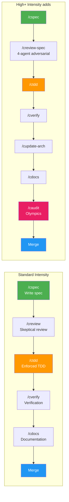
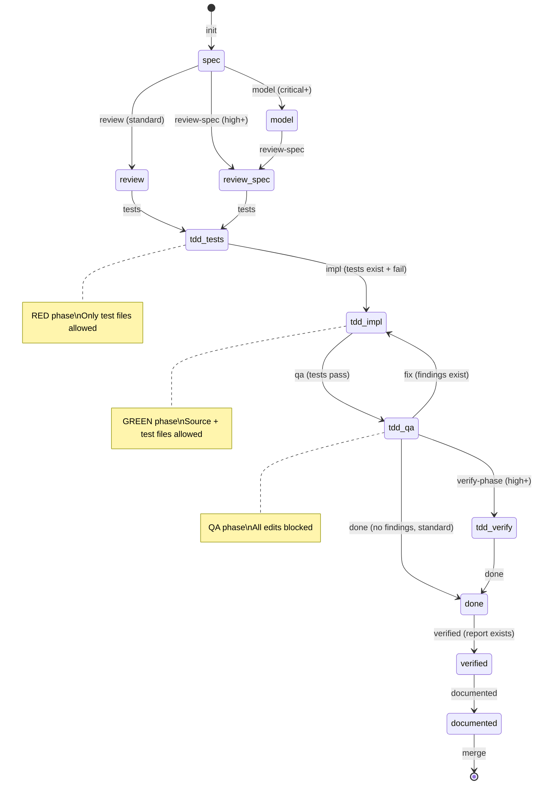
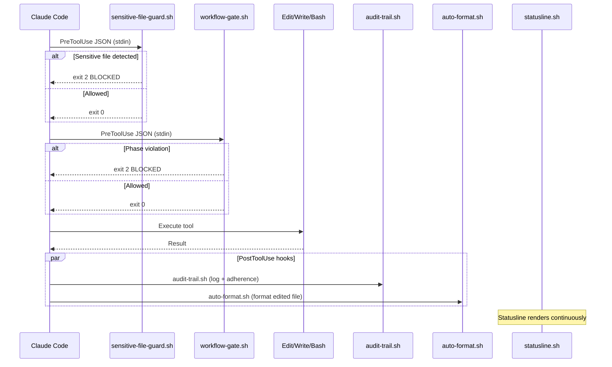
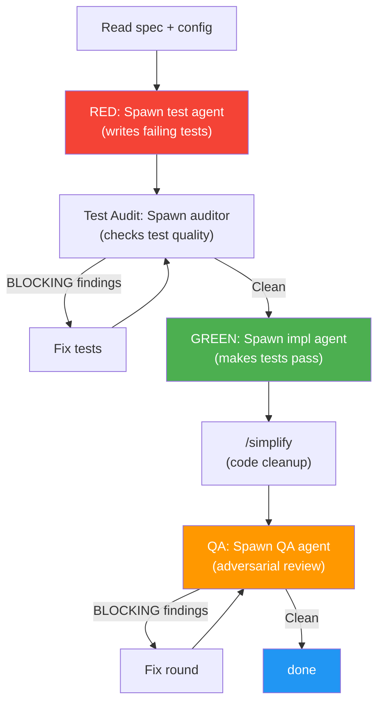
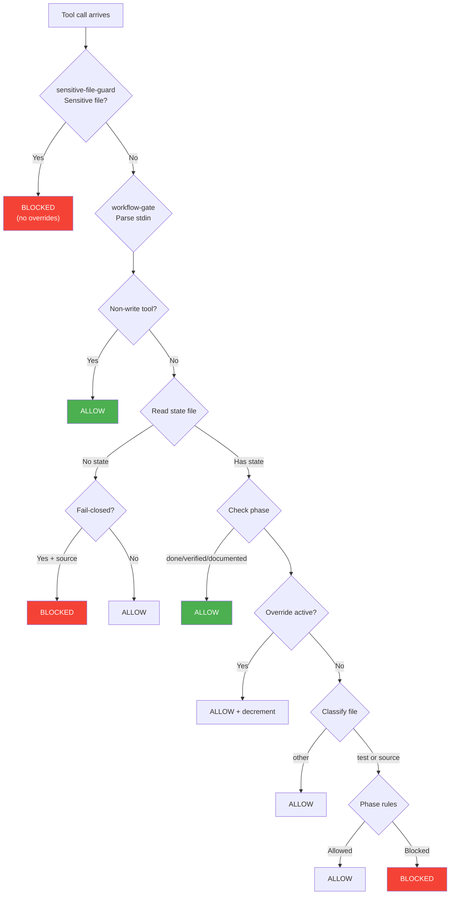
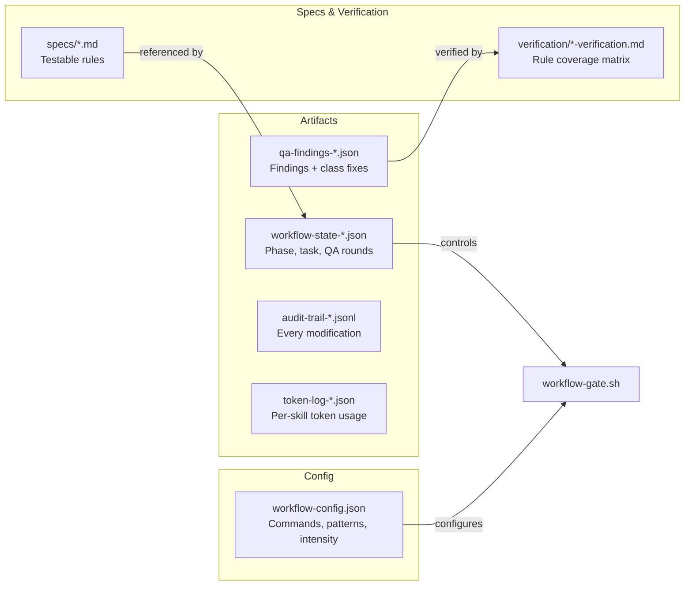

# Standard Workflow Guide

The standard Correctless workflow enforces a linear pipeline: **spec, review, TDD, verify, docs, merge**. Each step is a separate skill invocation. The human decides when to advance — skills never auto-invoke the next skill.

[Back to documentation index](index.md)

---

## 1. Pipeline Overview

At **high+ intensity**, the pipeline expands: `/creview` becomes `/creview-spec` (4-agent adversarial review), `/cupdate-arch` runs after verification, and `/caudit` (Olympics convergence audit) runs before merge.

The state machine in `hooks/workflow-advance.sh` enforces the ordering — you cannot skip phases or go backwards. Each transition has a gate that validates preconditions (e.g., tests must fail before advancing from RED to GREEN, verification report must exist before advancing to documented).

---

## 2. State Machine Transitions

Each phase transition is a named command in `hooks/workflow-advance.sh`. Key gates:

| Transition | Gate |
|---|---|
| **init → spec** | Must be on a feature branch, not main |
| **spec → review/review-spec** | Spec file must exist |
| **review → tdd-tests** | Spec reviewed |
| **tdd-tests → tdd-impl (RED → GREEN)** | `commands.test_new` must fail — tests exist and are red |
| **tdd-impl → tdd-qa (GREEN → QA)** | `commands.test_new` must pass — implementation is green |
| **tdd-qa → done** | Full test suite (`commands.test`) must pass |
| **done → verified** | Verification report file must exist |
| **verified → documented** | Documentation updated |

State is stored in `.correctless/artifacts/workflow-state-{branch-slug}.json`. Only `workflow-advance.sh` writes to this file.

---

## 3. Hook Architecture

Five hooks run on every tool call:

| Hook | Type | Purpose |
|---|---|---|
| **sensitive-file-guard.sh** | PreToolUse | Blocks writes to `.env`, credentials, keys. Fail-closed, no overrides. |
| **workflow-gate.sh** | PreToolUse | Enforces phase-specific file restrictions (RED blocks source, QA blocks everything). |
| **audit-trail.sh** | PostToolUse | Logs every file modification with phase context to JSONL. Tracks adherence metrics. |
| **auto-format.sh** | PostToolUse | Runs the project's formatter on edited files. Allowlist-validated, array-based execution. |
| **statusline.sh** | Statusline | Shows branch, phase, QA round, cost, context %, lines delta. |

All hooks follow [PAT-001](https://github.com/joshft/correctless/blob/main/.correctless/ARCHITECTURE.md): `set -euo pipefail` + `set -f`, jq check, bulk `eval`+`jq @sh` stdin parse, fast-path exit 0 before loading config.

---

## 4. TDD Cycle (RED → GREEN → QA)

The `/ctdd` skill is an **orchestrator** — it spawns separate agents for each phase and never writes code itself. This enforces agent separation:

- **Test agent (RED)** sees the spec rules but no implementation plan
- **Implementation agent (GREEN)** sees the failing tests but didn't write them
- **QA agent** is independent of both — reviews with a hostile lens

**RED phase:** Tests are written encoding every spec rule (INV-xxx, PRH-xxx, BND-xxx). The workflow gate blocks source edits unless they contain `STUB:TDD` markers. A **test audit** agent checks test quality before implementation begins.

**GREEN phase:** The implementation agent makes tests pass. A calm reset prompt fires after 3 consecutive failures to redirect away from dead-end approaches.

**QA phase:** All edits are blocked. Every BLOCKING finding must include both an **instance fix** (fix this bug) and a **class fix** (prevent this category). The fix → re-QA loop runs up to 3 rounds at high intensity.

---

## 5. Phase Gating Decision Tree

The most common path (non-write tools like Read/Grep) exits at the fast-path check before loading any config or state.

**Phase-specific rules:**

| Phase | Source files | Test files |
|---|---|---|
| spec / review / model | Blocked | Blocked |
| tdd-tests (RED) | Blocked (unless STUB:TDD) | Allowed |
| tdd-impl (GREEN) | Allowed | Allowed (logged) |
| tdd-qa / tdd-verify | Blocked | Blocked |
| done / verified / documented | Allowed | Allowed |
| audit | Allowed | Allowed |

The override mechanism (`workflow-advance.sh override "reason"`) grants 10 tool calls that bypass gating.

---

## 6. Data Flow

All workflow artifacts are branch-scoped — the branch slug is embedded in filenames. This allows concurrent workflows on different branches. `workflow-advance.sh reset` cleans up all branch-scoped artifacts.

| Artifact | Purpose | Created by |
|---|---|---|
| `workflow-state-{slug}.json` | Current phase, task, branch, QA rounds | `workflow-advance.sh` |
| `qa-findings-{slug}.json` | QA findings with instance + class fixes | `/ctdd` orchestrator |
| `audit-trail-{slug}.jsonl` | Every file modification with phase context | `audit-trail.sh` |
| `token-log-{slug}.json` | Per-skill token usage for `/cmetrics` | Each skill |
| `specs/{name}.md` | Testable rules (INV/PRH/BND) | `/cspec` |
| `verification/{name}-verification.md` | Rule coverage matrix | `/cverify` |
